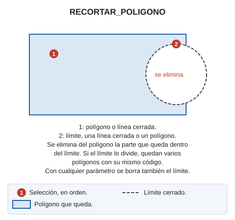

# RECORTAR\_POLÍGONO

Recorta un polígono eliminando la parte de éste que intersecciona con un límite.

## Parámetros

| Número de parámetro | Descripción | Valores | Opcional |
| :--- | :--- | :--- | :--- |
| 1 | Eliminar la línea de límite | Cualquier valor, como por ejemplo un 1 | Si |

## Observaciones

Esta orden solicita que se seleccione un polígono a recortar. Únicamente permitirá seleccionar entidades de tipo _polígono_ o entidades de tipo _línea_ si ésta está cerrada.  
A continuación solicita que se seleccione la entidad que actuará de límite. El límite puede ser una línea cerrada o un polígono. Si es un polígono, la orden usa como límite su contorno exterior e ignora sus huecos.

La orden analiza la intersección entre ambas entidades y crea un o unos \(pues es posible que la línea de límite parta el polígono en varias partes\) polígonos.

## Características de la orden

| Tipo de orden | [Orden interactiva](recortar-poligono.md) |
| :--- | :--- |
| Repite automáticamente | No |
| Opción del menú donde aparece la orden | Editar/Polígonos/Recortar polígono |
| Barra de herramientas en la que aparece la orden | _Esta orden no tiene asociado ningún botón en ninguna barra de herramientas_ |
| Extensión | DigiNG.OrdenesStandard.dll |
| Variables relacionadas | No tiene variables relacionadas |
| Código fuente | [DigiNG.Commands](https://github.com/digi21/DigiNG.Commands) |

