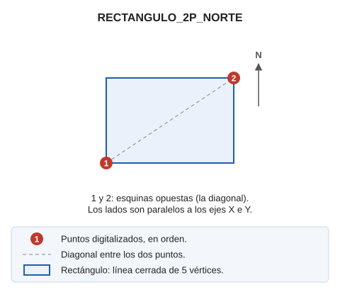

# RECTANGULO\_2P\_NORTE

Dibuja un rectángulo orientado al norte definido por dos puntos opuestos en diagonal.

## Parámetros

No admite parámetros.

## Características de la orden

| Tipo de orden | [Orden interactiva](rectangulo-2p-norte.md) |
| :--- | :--- |
| Repite automáticamente | No |
| Opción del menú donde aparece la orden | Dibujar/Más/Rectángulo con 2 puntos orientado a norte |
| Barra de herramientas en la que aparece la orden | Cuadrados y rectángulos |
| Extensión | DigiNG.OrdenesStandard.dll |
| Variables relacionadas | No tiene variables relacionadas |
| Órdenes relacionadas | [2P](/digi3d-ai/referencia/ventana-de-dibujo/ordenes/2/2p.md) [2P\_AA](/digi3d-ai/referencia/ventana-de-dibujo/ordenes/2/2p-aa.md) [3P](/digi3d-ai/referencia/ventana-de-dibujo/ordenes/3/3p.md) [RECTANGULO\_DR](/digi3d-ai/referencia/ventana-de-dibujo/ordenes/r/rectangulo-dr.md) |
| Nombre interno | {EDBBB1EB-6305-4E55-9A05-BEEDE794D376} |
