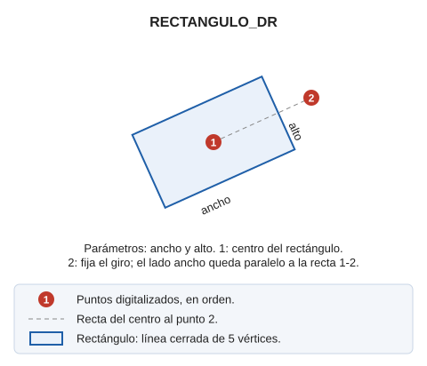

# RECTANGULO\_DR

Digitaliza un rectángulo con las dimensiones especificadas permitiendo rotarlo.

## Parámetros

| Número de parámetro | Descripción | Opcional |
| :--- | :--- | :--- |
| 1 | Ancho | No |
| 2 | Alto | No |

## Observaciones

El primer punto que digitalizas es el **centro** del rectángulo. El segundo punto fija el giro: el lado ancho queda paralelo a la recta que une los dos puntos.

## Características de la orden

| Tipo de orden | [Orden interactiva](rectangulo-dr.md) |
| :--- | :--- |
| Repite automáticamente | Si |
| Opción del menú donde aparece la orden | _Esta orden no tiene asociada ninguna opción de menú_ |
| Barra de herramientas en la que aparece la orden | _Esta orden no tiene asociado ningún botón en ninguna barra de herramientas_ |
| Extensión | DigiNG.OrdenesStandard.dll |
| Variables relacionadas | [REPITE](/digi3d-ai/referencia/ventana-de-dibujo/variables/r/repite.md) — repite la última orden ejecutada |
| Nombre interno | {D1327156-0A55-43D3-AB1B-62397E5D90EF} |
