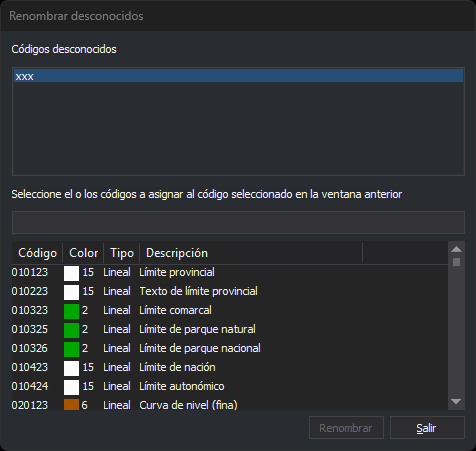

# RENOMBRAR\_CODIGOS\_DESCONOCIDOS
<!-- id: renombrar-codigos-desconocidos -->

Sustituye los códigos desconocidos de las entidades del archivo de dibujo activo por códigos de la tabla de códigos.

## Parámetros

No admite parámetros.

## Observaciones

Un código es desconocido cuando no está definido en la tabla de códigos, por ejemplo porque el archivo de dibujo se creó con otra tabla. La orden busca los códigos desconocidos en las entidades no borradas del archivo de dibujo activo. No busca en el resto de archivos de dibujo cargados.

Para quitar los códigos desconocidos sin sustituirlos, usa [ELIMINAR\_CODIGOS\_DESCONOCIDOS](/digi3d-ai/referencia/ventana-de-dibujo/ordenes/e/eliminar-codigos-desconocidos.md).

### Cuadro de diálogo

Al ejecutar la orden se muestra el cuadro _Renombrar desconocidos_:

| Campo | Descripción |
| :--- | :--- |
| Códigos desconocidos | Códigos desconocidos del archivo de dibujo activo, en orden alfabético y sin repetir. Cada clic selecciona o deselecciona un código, de modo que puedes seleccionar varios sin pulsar ninguna tecla |
| Buscar | Filtra la lista de códigos de la tabla. Consulta [Búsqueda](#búsqueda) |
| Lista de códigos | Códigos de la tabla de códigos, con su color, su tipo (puntual, lineal o virtual) y su descripción. Para seleccionar varios, mantén pulsada la tecla **Ctrl** o **Mayús** mientras haces clic |

Si el archivo de dibujo activo no tiene códigos desconocidos, la lista _Códigos desconocidos_ aparece vacía y el campo _Buscar_ y la lista de códigos aparecen desactivados.

### Búsqueda

El campo _Buscar_ filtra la lista de códigos mientras escribes:

* Un texto muestra los códigos que empiezan por ese texto y los códigos cuya descripción lo contiene. En el código se distinguen mayúsculas y minúsculas, y `?` sustituye a un carácter cualquiera. En la descripción no se distinguen mayúsculas y minúsculas.
* Un texto que empieza por `#` muestra los códigos que tienen la [etiqueta](/digi3d-ai/referencia/editor-de-tablas-de-codigos/pestanas/codigos/propiedades-del-codigo.md#etiquetas) escrita a continuación, sin distinguir mayúsculas y minúsculas. Por ejemplo, `#hidrografia`.
* Con el campo vacío, la lista muestra todos los códigos.

Al cambiar el texto, la lista de códigos pierde la selección.

### Renombrar los códigos

El botón _Renombrar_ se activa cuando hay al menos un código seleccionado en _Códigos desconocidos_ y uno en la lista de códigos. Al pulsarlo, la orden trata cada entidad no borrada del archivo de dibujo activo que tiene alguno de los códigos desconocidos seleccionados:

* quita a la entidad los códigos desconocidos seleccionados;
* conserva el resto de sus códigos en el mismo orden, incluidos los códigos desconocidos que no has seleccionado;
* añade al final los códigos seleccionados en la lista de códigos que la entidad no tiene ya.

Si seleccionas varios códigos de la tabla, cada entidad recibe todos y queda con varios códigos. Si seleccionas varios códigos desconocidos, todos se sustituyen por los mismos códigos.

La orden no modifica la entidad en el archivo: la borra y añade al final del archivo de dibujo una copia con los códigos nuevos. La copia conserva la geometría, el color, el grosor y los atributos de la entidad original.

Después de renombrar, el cuadro sigue abierto. La ventana de dibujo se regenera y la lista _Códigos desconocidos_ se calcula de nuevo: los códigos renombrados desaparecen de ella y no queda ningún código seleccionado. La lista de códigos conserva el filtro y la selección.

Pulsa _Salir_ para cerrar el cuadro y terminar la orden. _Salir_ no deshace los renombrados ya hechos.

[UNDO](/digi3d-ai/referencia/ventana-de-dibujo/ordenes/u/undo.md) deshace de una vez todos los renombrados hechos mientras el cuadro estuvo abierto.

Cada entidad se trata de forma independiente: si Digi3D.AI descarta una entidad con el código nuevo, solo se conserva su original y las demás se renombran.

## Características de la orden

| Tipo de orden | Orden inmediata |
| :--- | :--- |
| Repite automáticamente | No |
| Opción del menú donde aparece la orden | Editar/Renombrar códigos desconocidos... |
| Barra de herramientas en la que aparece la orden | _Esta orden no tiene asociado ningún botón en ninguna barra de herramientas_ |
| Extensión | DigiNG.OrdenesStandard.dll |
| Variables relacionadas | No tiene variables relacionadas |
| Órdenes relacionadas | [ELIMINAR\_CODIGOS\_DESCONOCIDOS](/digi3d-ai/referencia/ventana-de-dibujo/ordenes/e/eliminar-codigos-desconocidos.md) [RENOMCOD](/digi3d-ai/referencia/ventana-de-dibujo/ordenes/r/renomcod.md) [UNDO](/digi3d-ai/referencia/ventana-de-dibujo/ordenes/u/undo.md) |
| Nombre interno | {4B10E14D-3CF6-4CD3-975F-EE1544AA3C72} |
