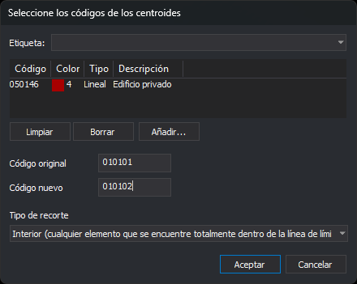

# RENOMCOD\_R
<!-- id: renomcod-r -->

Sustituye un código por otro en las entidades del archivo de dibujo activo que están dentro de los recintos de las topologías cargadas cuyo centroide tiene alguno de los códigos seleccionados. Las líneas que cruzan el contorno del recinto se pueden recortar por él.

## Parámetros

No admite parámetros.

## Observaciones

La orden trabaja sobre las topologías cargadas con [BINTOP](/digi3d-ai/referencia/ventana-de-dibujo/ordenes/b/bintop.md). Si no hay ninguna, la orden emite el sonido de error, muestra el aviso _No hay ningún archivo de topología cargado_ y termina.

### Cuadro de diálogo

Al ejecutar la orden se muestra el cuadro _Selecciona los códigos de los centroides_:

| Campo | Descripción | Valor por defecto |
| :--- | :--- | :--- |
| Lista de códigos | Códigos de los centroides. Solo se tratan los recintos cuyo centroide tiene alguno de estos códigos | _Vacía_ |
| Código original | Código que se sustituye. Admite comodines (`*`, `?`) | _Vacío_ |
| Código nuevo | Código que se pone en su lugar. Un `?` conserva el carácter del código original en esa posición, y un `*` conserva el resto del código original | _Vacío_ |
| Tipo de recorte | Qué entidades se consideran dentro del recinto. Ver [Tipos de recorte](#tipos-de-recorte) | Interior |

El botón _Aceptar_ solo se habilita si la lista tiene al menos un código y los campos _Código original_ y _Código nuevo_ no están vacíos. Al pulsar _Aceptar_, la orden guarda los dos códigos y el tipo de recorte en los valores `CodA`, `CodB` y `TipoInclusion` de la clave del registro `HKEY_CURRENT_USER\Software\Digi21\Digi3D.NET\DigiNG\Extensiones\DigiNG.OrdenesTopologia\RenomcodR`. La siguiente vez que ejecutes la orden, el cuadro muestra esos valores. Si pulsas _Cancelar_, la orden termina sin modificar nada.

### Entidades que se tratan

La orden solo trata las entidades del archivo de dibujo activo que:

* tienen el código original;
* son visibles y están en la zona de interés;
* no son arcos ni centroides de ninguna topología cargada.

En cada entidad tratada, la orden sustituye cada código que coincide con el código original y deja los demás códigos como estaban. El código nuevo no conserva el enlace con la base de datos del código original.

### Recintos y huecos

La orden recorre los recintos de todas las topologías cargadas y trata los que tienen un centroide con alguno de los códigos de la lista. Un recinto se recorta por su contorno exterior y por los contornos de sus huecos: lo que está dentro de una isla no está dentro del recinto. Si la isla es a su vez un recinto con uno de esos centroides, la orden la trata como un recinto más. Una entidad situada exactamente sobre el contorno se considera dentro.

### Tipos de recorte

| Tipo | Líneas | Polígonos y complejos | Puntos y textos |
| :--- | :--- | :--- | :--- |
| Interior | Cambian de código las que tienen todos sus vértices dentro. Las que cruzan el contorno no se tocan | Cambian de código los que están completamente dentro | Cambian de código si su punto de inserción está dentro |
| Corte | Las que cruzan el contorno se cortan por él: los trozos de dentro toman el código nuevo y los de fuera conservan el original. Las que están completamente dentro cambian de código | No se tocan | Cambian de código si su punto de inserción está dentro |
| Solape | Cambia de código entera cualquier línea con al menos un vértice dentro | Cambia de código cualquiera con al menos un vértice dentro | Cambian de código si su punto de inserción está dentro |

Los tipos _Interior_ y _Solape_ deciden por los vértices: una línea con todos los vértices dentro del recinto cuenta como interior aunque uno de sus tramos atraviese una isla.

### Final de la orden

Al terminar, la orden regenera la vista, emite el sonido de fin de orden y muestra un aviso con el número de recintos tratados, de entidades que han cambiado de código enteras y de líneas recortadas. Si ningún recinto tiene un centroide con alguno de los códigos de la lista, emite el sonido de error, muestra el aviso _Ningún recinto de las topologías cargadas tiene un centroide con alguno de los códigos seleccionados_ y no modifica nada.

La orden no descarga la topología: los arcos y los centroides no cambian.

[UNDO](/digi3d-ai/referencia/ventana-de-dibujo/ordenes/u/undo.md) deshace de una vez todos los cambios de la orden.

Si Digi3D.AI descarta alguno de los trozos nuevos de las líneas que corta un recinto, se conservan esas líneas sin cortar y no se añade ningún trozo. Los demás recintos se procesan con normalidad. Si descarta una entidad de dentro con el código nuevo, se conserva su original.

## Características de la orden

| Tipo de orden | Orden inmediata |
| :--- | :--- |
| Repite automáticamente | No |
| Opción del menú donde aparece la orden | _Esta orden no tiene asociada ninguna opción de menú_ |
| Barra de herramientas en la que aparece la orden | _Esta orden no tiene asociado ningún botón en ninguna barra de herramientas_ |
| Extensión | DigiNG.OrdenesTopologia.dll |
| Variables relacionadas | No tiene variables relacionadas |
| Órdenes relacionadas | [BINTOP](/digi3d-ai/referencia/ventana-de-dibujo/ordenes/b/bintop.md) [BORRA\_R](/digi3d-ai/referencia/ventana-de-dibujo/ordenes/b/borra-r.md) [CAMB\_COD\_R](/digi3d-ai/referencia/ventana-de-dibujo/ordenes/c/camb-cod-r.md) [RENOMCOD](/digi3d-ai/referencia/ventana-de-dibujo/ordenes/r/renomcod.md) [RENOMCOD\_SEL](/digi3d-ai/referencia/ventana-de-dibujo/ordenes/r/renomcod-sel.md) [UNDO](/digi3d-ai/referencia/ventana-de-dibujo/ordenes/u/undo.md) |
| Nombre interno | {ED48B9FA-78F6-4E31-A6E4-5237BD4BA9C8} |
