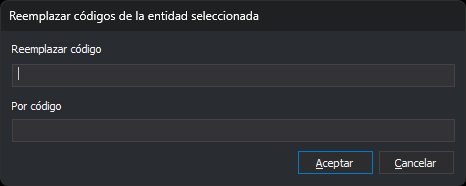

# RENOMCOD\_SEL
<!-- id: renomcod-sel -->

Sustituye un código por otro en las entidades que selecciones.

## Parámetros

| Número de parámetro | Descripción | Opcional |
| :--- | :--- | :--- |
| 1 | Código que se sustituye | Si |
| 2 | Código nuevo | Si |

## Observaciones

### Códigos

Si no indicas parámetros, la orden muestra el cuadro _Reemplazar código en las entidades seleccionadas_ en cuanto la ejecutas, antes de seleccionar ninguna entidad:

| Campo | Descripción |
| :--- | :--- |
| Reemplazar código | Código que se sustituye |
| Por código | Código nuevo |

El cuadro no propone ningún código: los dos campos aparecen vacíos. El botón _Aceptar_ está desactivado mientras alguno de los dos campos esté vacío. Si pulsas _Cancelar_, la orden termina sin cambiar nada.

Si indicas los dos parámetros, la orden no muestra el cuadro. Si indicas un solo parámetro, la orden emite el sonido de error y termina. A partir del tercero, la orden ignora los parámetros.

Los dos códigos admiten los comodines `*` y `?`. El código nuevo se combina con cada código de la entidad que coincide con el código que se sustituye, posición a posición, igual que en [RENOMCOD](/digi3d-ai/referencia/ventana-de-dibujo/ordenes/r/renomcod.md):

* Un carácter del código nuevo sustituye al del código de la entidad en esa posición.
* `?` conserva el carácter del código de la entidad.
* `*` conserva el resto del código de la entidad.

Si el código nuevo no está en la tabla de códigos, la orden lo asigna igualmente.

### Selección de las entidades

Después del cuadro, o directamente si has indicado los parámetros, la línea de órdenes indica _Selecciona una entidad o entidades para cambiar sus códigos_. La orden no usa las entidades que estuvieran seleccionadas antes de ejecutarla.

* **Selección simple:** selecciona una entidad con el pedal de datos o con el pedal tentativo. La orden ejecuta [TENTATIVO](/digi3d-ai/referencia/barras-de-herramientas/tentativo.md) con la cadena `LPTBGH*@`, que selecciona líneas, puntos, textos, imágenes, complejos y polígonos del archivo de dibujo activo. Si la entidad no pertenece al archivo de dibujo activo, la orden emite el sonido de error y sigue esperando.
* **Selección múltiple:** usa una orden de selección múltiple, por ejemplo [SELECCIONA\_VENTANA](/digi3d-ai/referencia/ventana-de-dibujo/ordenes/s/selecciona-ventana.md). La orden ignora las entidades borradas y las que no pertenecen al archivo de dibujo activo.

### Cambio de los códigos

En cada entidad seleccionada, la orden sustituye todos los códigos que coinciden con el código que se sustituye. Las entidades que no tienen ese código no cambian. La orden marca como borrada cada entidad modificada y añade una copia con los códigos nuevos.

El código nuevo no conserva los atributos de base de datos del código sustituido. La opción _Atributos de BBDD del código destino_ de RENOMCOD no afecta a esta orden.

La orden termina después de tratar la primera selección, aunque ninguna entidad tuviera el código. [UNDO](/digi3d-ai/referencia/ventana-de-dibujo/ordenes/u/undo.md) deshace el cambio.

Si indicas los parámetros y la variable [REPITE](/digi3d-ai/referencia/ventana-de-dibujo/variables/r/repite.md) está activa, la orden se repite con los mismos códigos. Si los códigos se indican en el cuadro, la orden no se repite.

## Características de la orden

| Tipo de orden | [Orden interactiva](/digi3d-ai/referencia/ventana-de-dibujo/ordenes-interactivas.md) |
| :--- | :--- |
| Repite automáticamente | Solo si indicas los parámetros |
| Opción del menú donde aparece la orden | Editar/Renombrar un código de entidades seleccionadas... |
| Barra de herramientas en la que aparece la orden | _Esta orden no tiene asociado ningún botón en ninguna barra de herramientas_ |
| Extensión | DigiNG.OrdenesStandard.dll |
| Variables relacionadas | [REPITE](/digi3d-ai/referencia/ventana-de-dibujo/variables/r/repite.md) — repite la última orden ejecutada |
| Órdenes relacionadas | [RENOMCOD](/digi3d-ai/referencia/ventana-de-dibujo/ordenes/r/renomcod.md) [RENOMCOD\_R](/digi3d-ai/referencia/ventana-de-dibujo/ordenes/r/renomcod-r.md) [UNDO](/digi3d-ai/referencia/ventana-de-dibujo/ordenes/u/undo.md) |
| Nombre interno | {BB0F09E4-995F-4B4F-9B87-EDE43791C8B6} |
