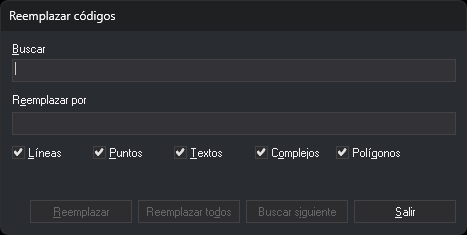

# RENOMCOD
<!-- id: renomcod -->

Sustituye un código por otro en las entidades del archivo de dibujo activo. Los dos códigos se indican como parámetros o en el cuadro de diálogo _Reemplazar códigos_.

## Parámetros

| Número de parámetro | Descripción | Valores | Opcional |
| :--- | :--- | :--- | :--- |
| 1 | Código que se busca | Código. Admite los comodines `*` y `?` | Si |
| 2 | Código nuevo | Código. Admite los comodines `*` y `?` | Si |
| 3 | [Tipo de geometría](/digi3d-ai/referencia/ventana-de-dibujo/tipos-de-geometria.md) | Cadena de letras: `L` líneas, `P` puntos y complejos puntuales, `C` líneas y puntos, `T` textos, `G` complejos, `H` polígonos, `B` imágenes. `*` incluye todos los tipos, también los que no tienen letra, como los multipuntos | Si |

Si no indicas los tres parámetros, la orden muestra el cuadro de diálogo _Reemplazar códigos_ y no usa los parámetros que hayas indicado.

## Observaciones

### Entidades que trata la orden

La orden solo trata entidades del archivo de dibujo activo que cumplen todas estas condiciones:

* están visibles y dentro de la zona de interés;
* no están borradas, salvo que la variable [BORRADOS](/digi3d-ai/referencia/ventana-de-dibujo/variables/b/borrados.md) esté activada;
* son de uno de los tipos indicados;
* tienen al menos un código que coincide con el código que se busca.

Si una entidad tiene varios códigos, la orden sustituye todos los que coinciden y conserva los demás.

La orden no modifica la entidad: la borra y añade al final del archivo de dibujo una copia con el código nuevo.

### Comodines

Los dos códigos admiten los comodines `*` y `?`. El código nuevo se combina con cada código que coincide con el que se busca, posición a posición:

* Un carácter del código nuevo sustituye al del código de la entidad en esa posición.
* `?` conserva el carácter del código de la entidad.
* `*` conserva el resto del código de la entidad.
* Si el código nuevo no termina en `*`, el resultado tiene su longitud: `020124` con `02?` da `020`.
* Si un `?` cae en una posición que el código de la entidad no tiene, el resultado termina ahí: `A` con `A?C` da `A`.

Por ejemplo, `RENOMCOD=02* 0211* *` cambia `020124` por `021124`.

### Código nuevo y atributos de base de datos

Si el código nuevo no existe en la tabla de códigos, la orden lo asigna igualmente y la entidad queda con un código desconocido. Para sustituir después esos códigos, ejecuta [RENOMBRAR\_CODIGOS\_DESCONOCIDOS](/digi3d-ai/referencia/ventana-de-dibujo/ordenes/r/renombrar-codigos-desconocidos.md).

La opción de configuración [Atributos de BBDD del código destino](/digi3d-ai/referencia/cuadros-de-dialogo/configuracion/renomcod/atributos-de-bbdd-del-codigo-destino.md) indica cómo se rellenan los atributos del código nuevo. Solo con la tercera opción se copian los valores no nulos del código sustituido. Si el código nuevo no tiene tabla de base de datos, la entidad se queda sin los atributos del código sustituido.

### Ejecución con parámetros

La orden muestra en la línea de órdenes _Renombrando el código: código buscado por código nuevo_ y el porcentaje de entidades examinadas. Después borra las entidades originales, añade las copias y emite un pitido.

### Cuadro de diálogo

El cuadro _Reemplazar códigos_ tiene estos campos y casillas:

| Campo | Descripción |
| :--- | :--- |
| Buscar | Código que se busca. Admite comodines |
| Reemplazar por | Código nuevo. Admite comodines |
| Líneas, Puntos, Textos, Complejos, Polígonos | Tipos de entidad que se tratan. La casilla _Puntos_ incluye los complejos puntuales. Las imágenes y los multipuntos no tienen casilla y se tratan siempre |

Al abrir el cuadro, los dos campos están vacíos y las cinco casillas están marcadas. El cuadro no guarda nada entre ejecuciones.

Los botones _Reemplazar_, _Reemplazar todos_ y _Buscar siguiente_ solo se habilitan cuando los dos campos tienen texto.

* **Buscar siguiente** busca la siguiente entidad que cumple las condiciones, desplaza la vista para centrarla en ella y la marca como seleccionada. Si no encuentra ninguna, muestra un mensaje, y el siguiente clic empieza otra vez por la primera entidad. Al cambiar uno de los campos, la búsqueda también empieza otra vez por la primera entidad.
* **Reemplazar** sustituye el código de la entidad encontrada y busca la siguiente. Si no hay ninguna entidad encontrada, solo busca. Si después de encontrarla has cambiado los campos o las casillas y la entidad ya no cumple las condiciones, no la sustituye.
* **Reemplazar todos** sustituye el código de todas las entidades que cumplen las condiciones. Si hay una entidad encontrada, empieza en esa entidad y no trata las anteriores; si no, empieza por la primera entidad del archivo. Si no encuentra ninguna, muestra un mensaje.
* **Salir** cierra el cuadro y termina la orden.

Los botones solo examinan las entidades que había en el archivo cuando empezó la búsqueda. Las copias que añade _Reemplazar_ no se vuelven a proponer.

[UNDO](/digi3d-ai/referencia/ventana-de-dibujo/ordenes/u/undo.md) deshace de una vez todas las sustituciones de una ejecución de la orden, también las que hayas hecho con varios botones del cuadro.

Cada entidad se trata de forma independiente: si Digi3D.AI descarta una entidad con el código nuevo, solo se conserva su original y las demás se renombran.

## Características de la orden

| Tipo de orden | [Orden interactiva](/digi3d-ai/referencia/ventana-de-dibujo/ordenes-interactivas.md) |
| :--- | :--- |
| Repite automáticamente | No |
| Opción del menú donde aparece la orden | Editar/Renombrar un código de todas las entidades... |
| Barra de herramientas en la que aparece la orden | _Esta orden no tiene asociado ningún botón en ninguna barra de herramientas_ |
| Extensión | DigiNG.OrdenesStandard.dll |
| Variables relacionadas | [BORRADOS](/digi3d-ai/referencia/ventana-de-dibujo/variables/b/borrados.md) |
| Órdenes relacionadas | [RENOMBRAR\_CODIGOS\_DESCONOCIDOS](/digi3d-ai/referencia/ventana-de-dibujo/ordenes/r/renombrar-codigos-desconocidos.md) [RENOMCOD\_R](/digi3d-ai/referencia/ventana-de-dibujo/ordenes/r/renomcod-r.md) [RENOMCOD\_SEL](/digi3d-ai/referencia/ventana-de-dibujo/ordenes/r/renomcod-sel.md) [UNDO](/digi3d-ai/referencia/ventana-de-dibujo/ordenes/u/undo.md) |
| Nombre interno | {9B7F40E2-E8FD-4e5b-8186-E5EB07294B2A} |
