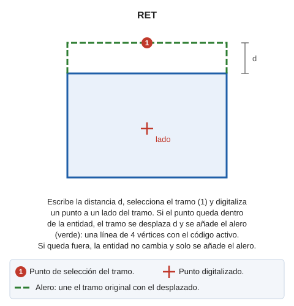

# RET
<!-- id: ret -->

Retranquea un segmento de una entidad.

## Parámetros

No admite parámetros.

## Observaciones

El procedimiento es el siguiente:

1. Escribe la distancia del retranqueo en la barra de estado o mídela digitalizando dos puntos.
2. Selecciona el segmento que se va a retranquear.
3. Digitaliza un punto en el lado hacia el que se desplaza el segmento. Los extremos del segmento desplazado son las intersecciones con las rectas de los segmentos contiguos.

Si el punto queda dentro de la entidad, el segmento se desplaza y se añade el alero: una línea de 4 vértices, con el código activo, que une el segmento original con el desplazado. Si el punto queda fuera, la entidad no cambia y solo se añade el alero.

Para seleccionar el segmento que se va a retranquear debe estar activo un modo de búsqueda que enganche proyectándose sobre el segmento y no en vértices.

## Características de la orden

| Tipo de orden | [Orden interactiva](ret.md) |
| :--- | :--- |
| Repite automáticamente | Si |
| Opción del menú donde aparece la orden | Editar/Polilíneas/Retranquear una línea |
| Barra de herramientas en la que aparece la orden | _Esta orden no tiene asociado ningún botón en ninguna barra de herramientas_ |
| Extensión | DigiNG.OrdenesStandard.dll |
| Variables relacionadas | [REPITE](/digi3d-ai/referencia/ventana-de-dibujo/variables/r/repite.md) — repite la última orden ejecutada |
| Órdenes relacionadas | No tiene órdenes relacionadas |
| Nombre interno | {0AF68209-0D11-480c-A85C-7F332089F1A6} |

