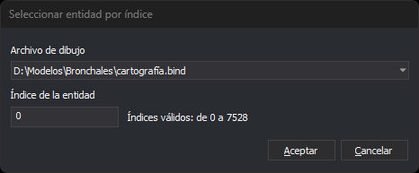

# SELECCIONA\_INDICE
<!-- id: selecciona-indice -->

Envía a la orden en ejecución la entidad que ocupa una posición determinada dentro de un archivo de dibujo cargado.

## Parámetros

| Número de parámetro | Descripción | Opcional |
| :--- | :--- | :--- |
| 1 | Índice del archivo de dibujo. Es la posición del archivo en el orden en que se cargaron el archivo de dibujo y los archivos de referencia: el 0 es el primer archivo cargado, que no tiene por qué ser el archivo de dibujo activo | Sí |
| 2 | Índice de la entidad dentro de ese archivo. La primera entidad es la 0 | Sí |

Los dos parámetros se escriben separados por un espacio, por ejemplo `SELECCIONA_INDICE 0 125`. Se indican los dos o ninguno. Cada uno tiene que ser un número natural de hasta 9 cifras, sin signo ni decimales. La orden no tiene en cuenta los parámetros a partir del tercero.

## Observaciones

El índice de la entidad es su posición dentro del archivo, contando también las entidades borradas.

La orden no termina la orden en ejecución: le envía la entidad y esta sigue activa. Si la orden en ejecución admite selección simple, recibe la entidad como seleccionada en su primer vértice. Si no la admite, recibe una pulsación del pulsador de datos en el primer vértice de la entidad. SELECCIONA\_INDICE no marca la entidad como seleccionada, no centra la vista en ella ni cambia el zoom.

### Cuadro de diálogo

Si se ejecuta sin parámetros, por ejemplo desde la opción de menú o desde el botón de la barra de herramientas, la orden muestra el cuadro _Seleccionar entidad por índice_:

| Campo | Descripción | Valor por defecto |
| :--- | :--- | :--- |
| Archivo de dibujo | Lista con el archivo de dibujo y los archivos de referencia cargados, en el orden de su índice | El archivo de dibujo activo |
| Índice de la entidad | Posición de la entidad dentro del archivo seleccionado, empezando en 0. Admite hasta 9 cifras | 0 |

A la derecha del campo _Índice de la entidad_ se muestra el rango de índices válidos para el archivo seleccionado, por ejemplo _Índices válidos: de 0 a 7528_. Si el archivo no tiene entidades, se muestra _El archivo de dibujo seleccionado no tiene entidades._ El texto se actualiza al seleccionar otro archivo en la lista.

El cuadro no guarda los valores: cada vez que se abre, muestra el archivo de dibujo activo y el índice 0.

Si pulsas _Aceptar_, el cuadro comprueba los dos valores:

* Si el archivo seleccionado no tiene entidades, muestra el mensaje _El archivo de dibujo seleccionado no tiene entidades._ y sitúa el cursor en la lista.
* Si el índice está vacío, no es un número natural o está fuera del rango, muestra el mensaje _El índice de la entidad tiene que ser un número entero entre 0 y N._, donde N es el último índice válido, y selecciona el contenido del campo.

En los dos casos el cuadro sigue abierto. Si los dos valores son válidos, el cuadro se cierra y la orden hace lo mismo que si se hubieran indicado como parámetros.

Si pulsas _Cancelar_, la orden termina sin enviar nada.

### Errores

La orden emite el sonido de error y no envía nada en estos casos:

* No hay ninguna orden en ejecución. En ese caso, la orden tampoco muestra el cuadro de diálogo.
* La orden en ejecución termina mientras el cuadro de diálogo está abierto.
* Se indica un solo parámetro, o alguno de los dos no es un número natural de hasta 9 cifras.
* El índice del archivo o el de la entidad está fuera de rango.
* La entidad está borrada y la variable [BORRADOS](/digi3d-ai/referencia/ventana-de-dibujo/variables/b/borrados.md) está desactivada.
* La entidad no es visible, porque está oculta o tiene desactivados todos sus códigos en la ventana de dibujo.
* La entidad está fuera de la zona de interés.
* La entidad no tiene vértices.

## Características de la orden

| Tipo de orden | Orden inmediata |
| :--- | :--- |
| Repite automáticamente | No |
| Opción del menú donde aparece la orden | Inmediato/Seleccionar entidad por posición en el archivo... |
| Barra de herramientas en la que aparece la orden | Selecciones |
| Extensión | DigiNG.OrdenesStandard.dll |
| Variables relacionadas | [BORRADOS](/digi3d-ai/referencia/ventana-de-dibujo/variables/b/borrados.md) |
| Órdenes relacionadas | [SELECCIONA\_ULTIMO](/digi3d-ai/referencia/ventana-de-dibujo/ordenes/s/selecciona-ultimo.md) |
| Nombre interno | {C735FB18-183F-4884-A85D-F08521DC40BC} |
