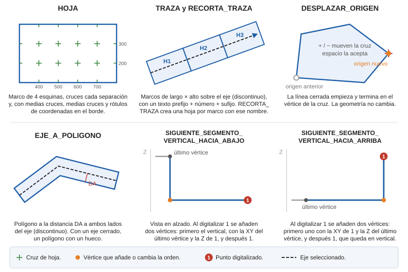

# SIGUIENTE\_SEGMENTO\_VERTICAL\_HACIA\_ABAJO

Configura la orden activa para indicar que el siguiente segmento a insertar será vertical y formado por dos puntos.

## Parámetros

No admite parámetros.

## Observaciones

Ejecuta la orden mientras digitalizas una línea que tenga al menos un vértice. Al digitalizar el siguiente punto, se añaden dos vértices:

1. Uno con las coordenadas X e Y del último vértice y la Z del punto digitalizado. El segmento que llega a él es vertical.
2. El punto digitalizado.

Compárala con [SIGUIENTE\_SEGMENTO\_VERTICAL\_HACIA\_ARRIBA](/digi3d-ai/referencia/ventana-de-dibujo/ordenes/s/siguiente-segmento-vertical-hacia-arriba.md), que pone el segmento vertical al final.

## Características de la orden

| Tipo de orden | [Orden interactiva](siguiente-segmento-vertical-hacia-abajo.md) |
| :--- | :--- |
| Repite automáticamente | No |
| Opción del menú donde aparece la orden | _Esta orden no tiene asociada ninguna opción de menú_ |
| Barra de herramientas en la que aparece la orden | _Esta orden no tiene asociado ningún botón en ninguna barra de herramientas_ |
| Extensión | DigiNG.OrdenesStandard.dll |
| Variables relacionadas | No tiene variables relacionadas |
| Nombre interno | {DA45C592-DA83-42A8-9B8E-578385974698} |

