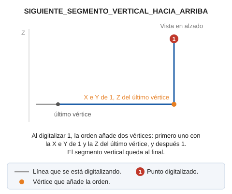

# SIGUIENTE\_SEGMENTO\_VERTICAL\_HACIA\_ARRIBA
<!-- id: siguiente-segmento-vertical-hacia-arriba -->

Configura la orden activa para indicar que el siguiente segmento a insertar será vertical y formado por dos puntos.

## Parámetros

No admite parámetros.

## Observaciones

Ejecuta la orden mientras digitalizas una línea que tenga al menos un vértice. Al digitalizar el siguiente punto, se añaden dos vértices:

1. Uno con las coordenadas X e Y del punto digitalizado y la Z del último vértice.
2. El punto digitalizado. El segmento que llega a él es vertical.

Compárala con [SIGUIENTE\_SEGMENTO\_VERTICAL\_HACIA\_ABAJO](/digi3d-ai/referencia/ventana-de-dibujo/ordenes/s/siguiente-segmento-vertical-hacia-abajo.md), que pone el segmento vertical al principio.

## Características de la orden

| Tipo de orden | [Orden interactiva](siguiente-segmento-vertical-hacia-arriba.md) |
| :--- | :--- |
| Repite automáticamente | No |
| Opción del menú donde aparece la orden | _Esta orden no tiene asociada ninguna opción de menú_ |
| Barra de herramientas en la que aparece la orden | _Esta orden no tiene asociado ningún botón en ninguna barra de herramientas_ |
| Extensión | DigiNG.OrdenesStandard.dll |
| Variables relacionadas | No tiene variables relacionadas |
| Órdenes relacionadas | [SIGUIENTE\_SEGMENTO\_VERTICAL\_HACIA\_ABAJO](/digi3d-ai/referencia/ventana-de-dibujo/ordenes/s/siguiente-segmento-vertical-hacia-abajo.md) |
| Nombre interno | {6E8ABC67-F614-475B-844E-9762CAFCFBF0} |

