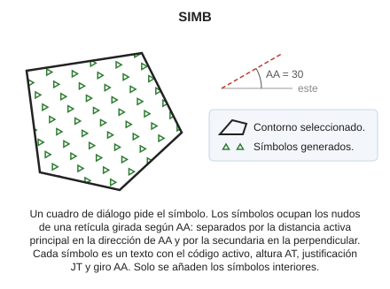
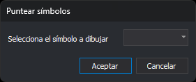

# SIMB
<!-- id: simb -->

Rellena el interior de una entidad superficial de contorno cerrado con una trama de símbolos.

## Parámetros

| Número de parámetro | Descripción | Opcional |
| :--- | :--- | :--- |
| 1 | Código o códigos (uno o más, separados por espacios) | Si |

Sin parámetros, la orden pide que selecciones la línea que se va a rellenar. Con códigos, rellena todas las líneas cerradas visibles de esos códigos y termina.

## Cuadro de diálogo Puntear símbolos

Al ejecutar la orden, antes de procesar los parámetros, aparece el cuadro de diálogo **Puntear símbolos**:

El desplegable **Selecciona el símbolo a dibujar** contiene los símbolos cargados con la tabla de códigos. Solo aparecen los símbolos cuyo nombre no es un número: los nombres numéricos corresponden a caracteres de las fuentes. Al abrir el cuadro aparece seleccionado el último símbolo aceptado o, si ese símbolo ya no está en la tabla de códigos, el primero de la lista.

* **Aceptar** continúa la orden con el símbolo seleccionado. Si la tabla de códigos no tiene símbolos, el desplegable aparece vacío y Aceptar termina la orden igual que Cancelar.
* **Cancelar** termina la orden sin añadir nada.

## Observaciones

Sin parámetros, la orden muestra el mensaje «Seleccione la línea para puntear con símbolos». Pulsa el botón de datos o el de tentativo sobre la línea que se va a rellenar. Si la entidad seleccionada no es una línea, suena el aviso de error y la orden sigue esperando. Al rellenar la línea, la orden emite un pitido y termina. La orden no comprueba que la línea seleccionada esté cerrada.

Los símbolos se sitúan en los mismos puntos que los de [PUNTEAR](/digi3d-ai/referencia/ventana-de-dibujo/ordenes/p/puntear.md), en los cruces de las rayas que generaría [TRAMAR](/digi3d-ai/referencia/ventana-de-dibujo/ordenes/t/tramar.md):

* En la dirección del [ángulo activo](/digi3d-ai/referencia/ventana-de-dibujo/variables/a/aa.md), los símbolos están separados por la distancia activa principal.
* En la dirección perpendicular, están separados por la distancia activa secundaria.

Las dos distancias se asignan con [DA](/digi3d-ai/referencia/ventana-de-dibujo/variables/d/da.md).

Cada símbolo se añade como un texto cuyo contenido es `@` seguido del nombre del símbolo, con el código activo y con Z = 0. El texto toma la altura de [AT](/digi3d-ai/referencia/ventana-de-dibujo/variables/a/at.md), la justificación de [JT](/digi3d-ai/referencia/ventana-de-dibujo/variables/j/jt.md) y el giro del ángulo activo. Solo se añaden los textos que quedan completamente dentro del contorno.

El símbolo se dibuja solo si el código activo usa una fuente de Digi. Si el código activo usa una fuente TrueType, se escribe literalmente el texto `@nombre`.

## Características de la orden

| Tipo de orden | [Orden interactiva](/digi3d-ai/referencia/ventana-de-dibujo/ordenes-interactivas.md) |
| :--- | :--- |
| Repite automáticamente | No |
| Opción del menú donde aparece la orden | Dibujar/Más/Rellenar polígono con símbolos |
| Barra de herramientas en la que aparece la orden | _Esta orden no tiene asociado ningún botón en ninguna barra de herramientas_ |
| Extensión | DigiNG.OrdenesStandard.dll |
| Variables relacionadas | [AA](/digi3d-ai/referencia/ventana-de-dibujo/variables/a/aa.md) — ángulo activo [AT](/digi3d-ai/referencia/ventana-de-dibujo/variables/a/at.md) — altura de los textos [DA](/digi3d-ai/referencia/ventana-de-dibujo/variables/d/da.md) — distancia activa [JT](/digi3d-ai/referencia/ventana-de-dibujo/variables/j/jt.md) — justificación del texto |
| Órdenes relacionadas | [DIVIDIR](/digi3d-ai/referencia/ventana-de-dibujo/ordenes/d/dividir.md) [PUNTEAR](/digi3d-ai/referencia/ventana-de-dibujo/ordenes/p/puntear.md) [RAYAR](/digi3d-ai/referencia/ventana-de-dibujo/ordenes/r/rayar.md) [TRAMAR](/digi3d-ai/referencia/ventana-de-dibujo/ordenes/t/tramar.md) |
| Nombre interno | {8C69C4FD-E23F-4c34-A90E-EEC98079CD61} |
