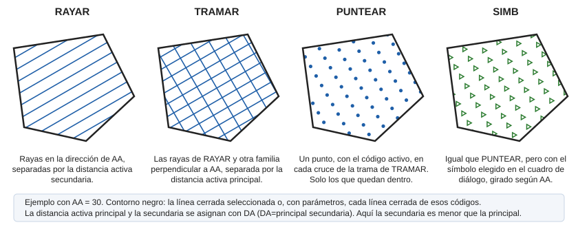

# SIMB

Rellena el interior de una entidad superficial de contorno cerrado usando una trama de símbolos.

## Parámetros

| Número de parámetro | Descripción | Opcional |
| :--- | :--- | :--- |
| 1 | Código o códigos (uno o más, separados por espacios) | Si |

## Observaciones

Al ejecutar la orden aparece un cuadro de diálogo para elegir el símbolo. Después, sin parámetros, selecciona la línea cerrada que se va a rellenar. Con códigos, la orden rellena todas las líneas cerradas visibles de esos códigos y termina.

Los símbolos se sitúan en los mismos puntos que los de [PUNTEAR](/digi3d-ai/referencia/ventana-de-dibujo/ordenes/p/puntear.md): en los cruces de las rayas que generaría [TRAMAR](/digi3d-ai/referencia/ventana-de-dibujo/ordenes/t/tramar.md), con la distancia activa principal en la dirección del [ángulo activo](/digi3d-ai/referencia/ventana-de-dibujo/variables/a/aa.md) y la secundaria en la perpendicular. Las dos distancias se asignan con [DA](/digi3d-ai/referencia/ventana-de-dibujo/variables/d/da.md).

Cada símbolo es un texto con el código activo. Toma la altura de [AT](/digi3d-ai/referencia/ventana-de-dibujo/variables/a/at.md), la justificación de [JT](/digi3d-ai/referencia/ventana-de-dibujo/variables/j/jt.md) y el giro del ángulo activo. Solo se añaden los símbolos que quedan dentro del contorno.

## Características de la orden

| Tipo de orden | [Orden interactiva](simb.md) |
| :--- | :--- |
| Repite automáticamente | Si |
| Opción del menú donde aparece la orden | Dibujar/Mas/Rellenar polígono con símbolos |
| Barra de herramientas en la que aparece la orden | _Esta orden no tiene asociado ningún botón en ninguna barra de herramientas_ |
| Extensión | DigiNG.OrdenesStandard.dll |
| Variables relacionadas | [AA](/digi3d-ai/referencia/ventana-de-dibujo/variables/a/aa.md) — ángulo activo [AT](/digi3d-ai/referencia/ventana-de-dibujo/variables/a/at.md) — altura de los textos [DA](/digi3d-ai/referencia/ventana-de-dibujo/variables/d/da.md) — distancia activa [JT](/digi3d-ai/referencia/ventana-de-dibujo/variables/j/jt.md) — justificación del texto [REPITE](/digi3d-ai/referencia/ventana-de-dibujo/variables/r/repite.md) — repite la última orden ejecutada |
| Nombre interno | {8C69C4FD-E23F-4c34-A90E-EEC98079CD61} |

