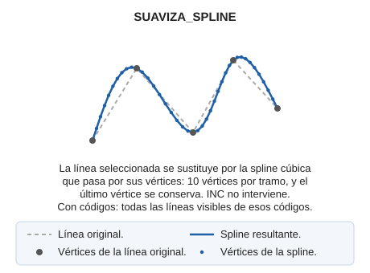

# SUAVIZA\_SPLINE

Suaviza una línea creando una spline cúbica.

## Parámetros

| Número de parámetro | Descripción | Opcional |
| :--- | :--- | :--- |
| 1 … N | Código o códigos de las entidades a suavizar | Si |

## Observaciones

La orden SUAVIZA\_SPLINE se puede ejecutar especificando el parámetro de código, es decir, si deseas suavizar todas las entidades que tengan un cierto código la entrada a la orden sería:

`SUAVIZA_SPLINE=020200`

Con códigos, la orden sustituye por su spline todas las líneas visibles de esos códigos y termina. Sin parámetros, solicita que selecciones la línea (o una selección de varias líneas).

El resultado es la spline cúbica que pasa por los vértices de la línea original: cada tramo se sustituye por 10 vértices, y el último vértice se conserva. A diferencia de [SUAVIZA](/digi3d-ai/referencia/ventana-de-dibujo/ordenes/s/suaviza.md), la separación entre los vértices nuevos no depende del incremento de registro INC.

## Características de la orden

| Tipo de orden | [Orden interactiva](suaviza-spline.md) |
| :--- | :--- |
| Repite automáticamente | Si |
| Opción del menú donde aparece la orden | _Esta orden no tiene asociada ninguna opción de menú_ |
| Barra de herramientas en la que aparece la orden | _Esta orden no tiene asociado ningún botón en ninguna barra de herramientas_ |
| Extensión | DigiNG.OrdenesStandard.dll |
| Variables relacionadas | [REPITE](/digi3d-ai/referencia/ventana-de-dibujo/variables/r/repite.md) — repite la última orden ejecutada |
| Órdenes relacionadas | [SPLINE](/digi3d-ai/referencia/ventana-de-dibujo/ordenes/s/spline.md) [SUAVIZA](/digi3d-ai/referencia/ventana-de-dibujo/ordenes/s/suaviza.md) |
| Nombre interno | {78596F76-80D8-43E2-894C-08B07686BCD5} |

