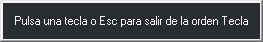
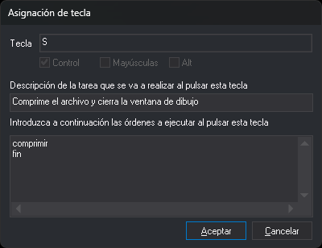

# TECLA
<!-- id: tecla -->

Asigna órdenes de Digi3D.AI a pulsaciones de teclas en el teclado virtual activo.

## Parámetros

| Número de parámetro | Descripción | Valores | Opcional |
| :--- | :--- | :--- | :--- |
| 1 | Archivo de texto con las órdenes a asignar, una por línea | Ruta de archivo | Si |

## Observaciones

Esta orden crea o modifica las asignaciones del teclado virtual activo (archivo `.keyboard.xml`) sin editar el archivo a mano.

1. Al ejecutar la orden aparece un cuadro con el texto _Pulsa una tecla o Esc para salir de la orden Tecla_:

   
2. Pulsa la tecla o la combinación de teclas a asignar, por ejemplo _Ctrl+a_ o _Mayús+F3_. Las teclas _Mayús_, _Ctrl_, _Alt_, _Pausa_ y _Bloq Mayús_ no se pueden asignar solas, y _Esc_ no se puede asignar.
3. Se abre el cuadro de diálogo **Asignación de tecla**:

   

   * **Tecla**: el nombre de la tecla pulsada. Es de solo lectura.
   * **Control**, **Mayúsculas** y **Alt**: indican qué modificadores estaban pulsados junto con la tecla. Están deshabilitadas porque la combinación la fija la pulsación. Para asignar otra combinación, pulsa _Cancelar_ y pulsa la combinación nueva.
   * **Descripción de la tarea**: el texto que describe lo que hace la tecla.
   * **Órdenes**: las órdenes que se ejecutan al pulsar la tecla, una por línea.

   Si la tecla ya tiene una asignación, el cuadro muestra sus órdenes y su descripción.
4. Pulsa _Aceptar_. La asignación sustituye a la anterior y se guarda en ese momento en el archivo `.keyboard.xml` del teclado virtual activo. La orden vuelve a esperar otra tecla.
5. Pulsa _Esc_ para terminar la orden.

Si pulsas _Cancelar_ en el cuadro de asignación, la tecla conserva su asignación anterior y la orden vuelve a esperar otra tecla.

Para eliminar la asignación de una tecla, borra todas sus órdenes y pulsa _Aceptar_.

El nombre de la tecla que se guarda depende del idioma de la distribución de teclado de Windows.

### Si no hay ningún teclado virtual cargado

Al pulsar _Aceptar_ en el cuadro de asignación, Digi3D.AI pregunta si se quiere crear un archivo de asignación de teclas y pide su nombre. Si respondes _No_ o cancelas la selección del archivo, la asignación no se guarda.

### Si no se puede guardar el archivo

Digi3D.AI muestra un cuadro con tres opciones:

* **Continuar**: la asignación se mantiene solo en memoria y se pierde al cerrar el programa.
* **Volver a probar**: intenta guardar el archivo otra vez.
* **Guardar en otro archivo**: pide otra ruta. Después hay que configurar Digi3D.AI para que cargue ese archivo.

### Con parámetro

Si se indica el parámetro, el cuadro de asignación muestra las órdenes leídas del archivo, no las que ya tenía la tecla, y la descripción aparece vacía. La orden termina después de pulsar _Aceptar_ o _Cancelar_ en el cuadro de asignación. El archivo se lee con la codificación ANSI de Windows. Si no se puede abrir, la orden se comporta como si no se hubiera indicado el parámetro.

Este modo es el que usa Digi3D.AI al asignar a una tecla una macroinstrucción grabada.

### Sin ninguna ventana de dibujo abierta

La opción del menú **Ventana fotogramétrica/Teclado/Programador de teclas** ejecuta esta orden si hay alguna ventana de dibujo abierta. Si solo hay ventanas fotogramétricas, ejecuta la versión de la extensión _Digi3D.CommonCommands.dll_ (nombre interno {4726C0C5-1522-4c56-A439-0D644E6D1BFE}). Esa versión muestra los mismos cuadros y guarda las asignaciones en el mismo teclado virtual, con dos diferencias:

* No admite el parámetro: no tiene nombre de orden y solo se ejecuta desde esa opción del menú.
* El cuadro **Asignación de tecla** no se puede redimensionar ni guarda su posición.

En la ventana fotogramétrica, la tecla _Intro_ abre siempre el cuadro [Introduce el nombre de la orden](/digi3d-ai/referencia/ordenes/formas-de-ejecutar-una-orden/ejecutar-una-orden-desde-la-linea-de-comandos/README.md), aunque tenga órdenes asignadas.

## Características de la orden

| Tipo de orden | Orden inmediata |
| :--- | :--- |
| Repite automáticamente | No |
| Opción del menú donde aparece la orden | Inmediato/Teclados virtuales/Asignar una orden al teclado virtual activo... Ventana fotogramétrica/Teclado/Programador de teclas |
| Barra de herramientas en la que aparece la orden | Teclados |
| Extensión | DigiNG.OrdenesStandard.dll (Digi3D.CommonCommands.dll si no hay ventanas de dibujo abiertas) |
| Variables relacionadas | No tiene variables relacionadas |
| Órdenes relacionadas | [CAMBIA\_TECLAS\_MNU](/digi3d-ai/referencia/ventana-de-dibujo/ordenes/c/cambia-teclas-mnu.md) |
| Nombre interno | {EB6809CA-AA03-4dfb-9D7A-D639EFDBC051} |

## Nota

Digi3D.AI no puede importar los archivos de teclas de versiones anteriores. Para importarlos, usa el [programa de consola](/digi3d-ai/primeros-pasos/primeros-pasos-usuarios-versiones-anteriores/archivos-configuracion-teclas.md).
