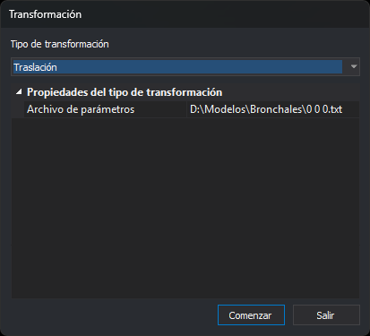

# TRANSFORMA
<!-- id: transforma -->

Aplica una transformación de coordenadas a las entidades del archivo de dibujo activo: Helmert, afín, absoluta, traslación, escala o una matriz de 3×3 o de 4×4.

## Parámetros

No admite parámetros.

## Observaciones

### Cuadro de diálogo



Al ejecutar la orden se muestra el cuadro _Transformación_:

| Campo | Descripción |
| :--- | :--- |
| Tipo de transformación | Helmert, Afín, Absoluta, Traslación, Escala, Tensor 3x3 o Tensor 4x4. Consulta [Tipos de transformación](#tipos-de-transformación) |
| Propiedades del tipo de transformación | Datos del tipo elegido. La escala muestra cuatro campos; el resto de tipos, el campo _Archivo de parámetros_ |

| Propiedad | Tipos | Descripción | Valor por defecto |
| :--- | :--- | :--- | :--- |
| Archivo de parámetros | Todos menos Escala | Archivo de texto con los datos de la transformación. El botón de la derecha abre el cuadro para elegirlo. Cada tipo recuerda su propio archivo | _Vacío_ |
| Factor X | Escala | Factor por el que se multiplica la coordenada X | 1 |
| Factor Y | Escala | Factor por el que se multiplica la coordenada Y | 1 |
| Factor Z | Escala | Factor por el que se multiplica la coordenada Z | 1 |
| Altura textos | Escala | _Sí_ multiplica la altura de los textos por el valor absoluto del factor X. _No_ conserva la altura | Sí |

Al abrirse, el cuadro tiene el foco en el botón _Comenzar_.

Si pulsas _Comenzar_, la orden guarda el tipo de transformación y sus propiedades en la clave del registro `HKEY_CURRENT_USER\Software\Digi21\Digi3D.NET\DigiNG\Extensiones\DigiNG.OrdenesStandard\Bintrans`, en los valores `TipoTransformacion`, `ArchivoHelmert`, `ArchivoAfin`, `ArchivoAbsoluta`, `ArchivoTraslacion`, `ArchivoTransformacion3x3`, `ArchivoTransformacion4x4`, `FactorX`, `FactorY`, `FactorZ` y `EscaladoAlturaTextos`. A continuación lee el archivo de parámetros y aplica la transformación. Si el archivo no es válido, muestra un mensaje, no modifica el archivo de dibujo y el cuadro sigue abierto. Si la transformación termina, el cuadro se cierra. La siguiente vez que ejecutes la orden, el cuadro muestra los valores guardados.

Si pulsas _Salir_, el cuadro se cierra sin guardar los valores y sin transformar nada.

### Tipos de transformación

En las fórmulas, (x, y, z) son las coordenadas originales y (X, Y, Z) las transformadas.

| Tipo | Transformación | Z | Puntos necesarios |
| :--- | :--- | :--- | :--- |
| Helmert | Semejanza en el plano: X = a·x + b·y + Tx, Y = −b·x + a·y + Ty. Calcula a, b, Tx y Ty por mínimos cuadrados | No cambia | 2 o más |
| Afín | X = a·x + b·y + c, Y = d·x + e·y + f. Calcula los 6 coeficientes por mínimos cuadrados | No cambia | 3 o más, no alineados |
| Absoluta | Semejanza en el espacio: un factor de escala, tres giros y una traslación, calculados por mínimos cuadrados | Cambia | Entre 3 y 1000, no alineados |
| Traslación | X = x + (X1 − x1), Y = y + (Y1 − y1), Z = z + (Z1 − z1) | Cambia | 1 |
| Escala | X = Factor X · x, Y = Factor Y · y, Z = Factor Z · z. El centro de la escala es el origen de coordenadas (0, 0, 0) | Cambia | Ninguno |
| Tensor 3x3 | X = a00·x + a10·y + a20·z, Y = a01·x + a11·y + a21·z, Z = a02·x + a12·y + a22·z | Cambia | Ninguno |
| Tensor 4x4 | Igual que el tensor 3x3, más la traslación (a30, a31, a32). La orden no usa la cuarta columna (a03, a13, a23, a33) | Cambia | Ninguno |

En Helmert y en la afín, los puntos origen, por un lado, y los puntos destino, por otro, tienen que ser distintos. En la afín y en la absoluta, además, no pueden estar todos en una recta: algún punto tiene que distar de la recta que une los dos puntos más alejados más de una milésima de la distancia entre ellos.

### Archivo de parámetros

El archivo de parámetros es un archivo de texto. Cada línea contiene números separados por espacios, tabuladores o comas. Los decimales se escriben con punto, sea cual sea la configuración regional de Windows. La orden admite los números en notación científica (`1.5e3`) y un archivo UTF-8 con marca BOM.

| Tipo | Contenido de cada línea | Líneas que lee |
| :--- | :--- | :--- |
| Helmert, Afín | x y X Y: coordenadas de un punto en el sistema original y en el sistema destino | Todas |
| Absoluta | x y z X Y Z | Todas, hasta 1000 |
| Traslación | x1 y1 z1 X1 Y1 Z1 | La primera línea con 6 números |
| Tensor 3x3 | Una fila de la matriz: a_i0 a_i1 a_i2 | Las 3 primeras líneas con 3 números |
| Tensor 4x4 | Una fila de la matriz: a_i0 a_i1 a_i2 a_i3 | Las 4 primeras líneas con 4 números |

La orden ignora las líneas vacías y las que tienen menos números de los necesarios, y también los elementos que hay después de los necesarios. Por ejemplo, una quinta columna con el nombre del punto en un archivo de Helmert. Si una línea tiene suficientes elementos y alguno de los necesarios no es un número (por ejemplo, una cabecera `X Y X' Y'`), la orden muestra un mensaje con el número de esa línea y no transforma nada.

Archivo para Helmert o afín:

```
450000.00 4500000.00 450012.35 4500105.20
451000.00 4500000.00 451012.80 4500104.95
451000.00 4501000.00 451012.55 4501105.40
```

Archivo para la traslación:

```
0 0 0 1000 2000 0
```

Archivo para el tensor 4x4, con un giro de 90° y una traslación de (100, 200, 0):

```
0 1 0 0
-1 0 0 0
0 0 1 0
100 200 0 1
```

La orden muestra un mensaje, no transforma nada y deja el cuadro abierto en estos casos:

* El archivo no existe, no se puede abrir o el campo está vacío.
* Una línea contiene un valor que no es un número.
* El archivo no tiene suficientes líneas con números. El mensaje indica cuántas líneas necesita el tipo elegido y cuántos números tiene que haber en cada una.
* La absoluta tiene más de 1000 puntos.
* Los puntos están repetidos o alineados y no determinan la transformación.

### Entidades que transforma

La orden transforma las entidades del archivo de dibujo activo que no están borradas, son visibles y están dentro de la zona de interés. No transforma los demás archivos de dibujo cargados. Cada entidad se borra y se sustituye por una copia transformada, que se añade al final del archivo.

* Se transforman todos los vértices: los huecos de los polígonos y cada entidad de los complejos.
* El giro de los textos, de los símbolos de los puntos y de los complejos puntuales cambia lo mismo que la transformación gira, en el plano XY, la dirección de ese giro. Con una transformación que refleja el dibujo, el texto sigue la dirección reflejada, pero los caracteres no se reflejan.
* La altura de los textos solo cambia con la escala, si _Altura textos_ es _Sí_. Con el resto de tipos se conserva, aunque la transformación incluya un factor de escala.
* El tamaño de los símbolos de los puntos no cambia.

Al terminar, la orden recalcula los límites del archivo de dibujo. [UNDO](/digi3d-ai/referencia/ventana-de-dibujo/ordenes/u/undo.md) deshace la transformación completa de una sola vez.

## Características de la orden

| Tipo de orden | Orden inmediata |
| :--- | :--- |
| Repite automáticamente | No |
| Opción del menú donde aparece la orden | Editar/Avanzado/Transformar el archivo de dibujo \(Helmert, afín, absoluta, traslación, escala, tensor\)... |
| Barra de herramientas en la que aparece la orden | _Esta orden no tiene asociado ningún botón en ninguna barra de herramientas_ |
| Extensión | DigiNG.OrdenesStandard.dll |
| Variables relacionadas | No tiene variables relacionadas |
| Órdenes relacionadas | [UNDO](/digi3d-ai/referencia/ventana-de-dibujo/ordenes/u/undo.md) |
| Nombre interno | {0D75B4EC-3036-4684-95A4-D2119B3A6E88} |
