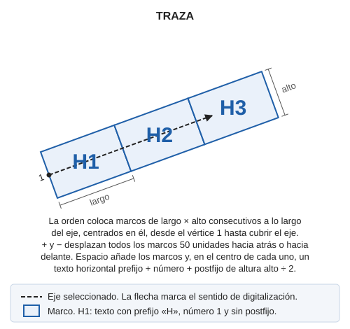
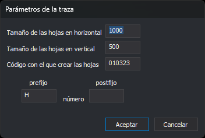

# TRAZA
<!-- id: traza -->

Crea un gráfico de hojas a lo largo de una línea que sirve de eje: marcos consecutivos y, en el centro de cada marco, un texto con el nombre de la hoja. La orden [RECORTA\_TRAZA](/digi3d-ai/referencia/ventana-de-dibujo/ordenes/r/recorta-traza.md) crea después un archivo por cada marco.

## Parámetros

No admite parámetros.

## Observaciones

### Cuadro de diálogo

Al ejecutar la orden se muestra el cuadro _Parámetros de la traza_:

| Campo | Descripción | Valor por defecto |
| :--- | :--- | :--- |
| Tamaño de las hojas en horizontal | Largo de cada marco, medido a lo largo del eje, en las unidades de las coordenadas del dibujo. Tiene que ser mayor que 0 | 700 |
| Tamaño de las hojas en vertical | Alto de cada marco, medido en perpendicular al eje, en las unidades de las coordenadas del dibujo. El marco queda centrado en el eje. Tiene que ser mayor que 0 | 500 |
| Código con el que crear las hojas | Código de los marcos y de los textos. Si el código no está en la tabla de códigos, la orden lo usa igualmente | HOJAS |
| Prefijo | Texto que va delante del número de la hoja. Puede estar vacío | H |
| Postfijo | Texto que va detrás del número de la hoja. Puede estar vacío | _Vacío_ |

Los campos _Prefijo_, _Número_ y _Postfijo_ del bloque _Texto de cada hoja_ muestran el orden en el que se forma el nombre de cada hoja. _Número_ no es un campo: es el número de la hoja, que la orden asigna.

Si pulsas _Aceptar_, el cuadro comprueba los dos tamaños. Si alguno no es un número, o no es un número finito mayor que 0, el cuadro muestra un mensaje, sitúa el cursor en ese campo y sigue abierto sin guardar nada. Si los valores son válidos, la orden los guarda en los valores `TamanoHorizontal`, `TamanoVertical`, `Codigo`, `Prefijo` y `Postfijo` de la clave del registro `HKEY_CURRENT_USER\Software\Digi21\Digi3D.NET\DigiNG\Extensiones\DigiNG.OrdenesStandard\Traza`. La siguiente vez que ejecutes la orden, el cuadro muestra esos valores.

Si pulsas _Cancelar_, la orden termina sin guardar los valores.

### Selección del eje

Después del cuadro, la línea de órdenes indica _Selecciona línea de eje de traza..._. Selecciona la línea que sirve de eje con el pedal de datos o con el pedal tentativo. La orden ejecuta [TENTATIVO](/digi3d-ai/referencia/barras-de-herramientas/tentativo.md) con la cadena `L*@`, que solo selecciona líneas del archivo de dibujo activo. Si la entidad seleccionada no es una línea, o tiene menos de 2 vértices, la orden emite el sonido de error y sigue esperando una línea.

Al seleccionar el eje, la orden dibuja los marcos provisionales:

* El primer marco empieza en el primer vértice del eje y sigue la dirección del primer tramo.
* Cada marco empieza donde acaba el anterior, medido a lo largo del eje, hasta cubrir el eje entero. El último marco puede sobrepasar el último vértice.
* Cada marco sigue la dirección del tramo del eje en el que empieza. Si un marco cruza un vértice del eje, la orden desplaza sus dos últimas esquinas a las dos primeras del marco siguiente, de modo que los dos marcos quedan unidos sin hueco ni solape. Ese marco deja de ser un rectángulo.

Si seleccionas otra línea, la orden borra los marcos provisionales y los calcula de nuevo sobre la línea nueva.

### Ajuste y creación de las hojas

Con el eje seleccionado, la línea de órdenes indica _[+] Desplaza las hojas hacia atrás [-] Desplaza las hojas hacia delante [Espacio] Crea las hojas_:

* La tecla **+** desplaza todos los marcos 50 unidades hacia atrás, en sentido contrario al de digitalización del eje. El primer marco empieza entonces antes del primer vértice.
* La tecla **−** desplaza todos los marcos 50 unidades hacia delante. El primer marco empieza entonces después del primer vértice, y el principio del eje queda sin cubrir.
* La tecla **espacio** añade los marcos al archivo de dibujo activo, añade un texto en cada marco y termina la orden.

Las teclas **+** y **−** funcionan en el teclado principal y en el numérico. Cada vez que seleccionas un eje, el desplazamiento vuelve a 0.

Cada marco es una línea cerrada de 5 vértices (las 4 esquinas y el cierre). Cada texto:

* tiene el código de los marcos;
* está en el punto de corte de las diagonales del marco, que en un marco rectangular es su centro, con justificación centrada;
* es horizontal, sin rotación, aunque el eje no lo sea;
* tiene una altura igual a la mitad del tamaño vertical;
* contiene el prefijo, el número de la hoja y el postfijo, sin separadores. El número empieza en 1 en el primer marco y aumenta de 1 en 1 a lo largo del eje, sin ceros a la izquierda: con el prefijo `H` y sin postfijo, los textos son `H1`, `H2`, `H3`...

Los marcos y los textos tienen la coordenada Z igual a 0, sea cual sea la Z del eje. La orden no modifica la línea del eje.

Hasta que pulses la tecla espacio, los marcos son provisionales: si terminas la orden de otro modo, por ejemplo ejecutando otra orden, la orden borra los marcos provisionales y no añade nada al archivo. Si pulsas la tecla espacio antes de seleccionar el eje, la orden termina sin añadir nada.

[UNDO](/digi3d-ai/referencia/ventana-de-dibujo/ordenes/u/undo.md) elimina de una vez todos los marcos y textos que ha añadido la orden.

### Creación de los archivos de las hojas

TRAZA no crea archivos. Para crear un archivo por cada hoja, ejecuta después [RECORTA\_TRAZA](/digi3d-ai/referencia/ventana-de-dibujo/ordenes/r/recorta-traza.md) con el mismo código de marco: esa orden usa el texto de cada marco como nombre del archivo.

## Características de la orden

| Tipo de orden | [Orden interactiva](/digi3d-ai/referencia/ventana-de-dibujo/ordenes-interactivas.md) |
| :--- | :--- |
| Repite automáticamente | No |
| Opción del menú donde aparece la orden | Dibujar/Gráfico de hojas/Crear gráfico de hojas \(traza\) |
| Barra de herramientas en la que aparece la orden | _Esta orden no tiene asociado ningún botón en ninguna barra de herramientas_ |
| Extensión | DigiNG.OrdenesStandard.dll |
| Variables relacionadas | No tiene variables relacionadas |
| Órdenes relacionadas | [HOJA](/digi3d-ai/referencia/ventana-de-dibujo/ordenes/h/hoja.md) [RECORTA\_TRAZA](/digi3d-ai/referencia/ventana-de-dibujo/ordenes/r/recorta-traza.md) [UNDO](/digi3d-ai/referencia/ventana-de-dibujo/ordenes/u/undo.md) |
| Nombre interno | {C1531BAF-268D-4b68-A830-884AF84BF21F} |
