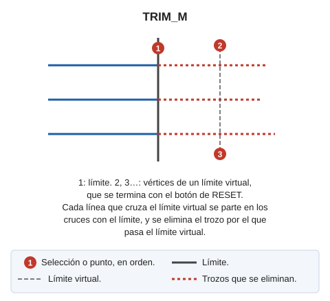

# TRIM\_M
<!-- id: trim-m -->

Recorta múltiples entidades, seleccionando primero la línea de límite y luego digitalizando un límite virtual.

## Parámetros

No admite parámetros

## Observaciones

Se recortarán todas las entidades que interseccionen con el límite virtual.

Si Digi3D.AI descarta alguno de los trozos nuevos de una entidad, la orden no la recorta y la entidad original se conserva. Con varias entidades, cada una se trata de forma independiente: solo se conserva el original de cada entidad descartada y las demás se recortan.

## Características de la orden

| Tipo de orden | [Orden interactiva](trim-m.md) |
| :--- | :--- |
| Repite automáticamente | Si |
| Opción del menú donde aparece la orden | Editar/Polilíneas/Recortar múltiples líneas en el cruce con otra línea |
| Barra de herramientas en la que aparece la orden | Extender/Recortar |
| Extensión | DigiNG.OrdenesStandard.dll |
| Variables relacionadas | [REPITE](/digi3d-ai/referencia/ventana-de-dibujo/variables/r/repite.md) — repite la última orden ejecutada |
| Órdenes relacionadas | [EXT\_M](/digi3d-ai/referencia/ventana-de-dibujo/ordenes/e/ext-m.md) [TRIM](/digi3d-ai/referencia/ventana-de-dibujo/ordenes/t/trim.md) [TRIM\_LADO](/digi3d-ai/referencia/ventana-de-dibujo/ordenes/t/trim-lado.md) |
| Nombre interno | {729B6BE7-084A-4F15-802C-F649D5348563} |

