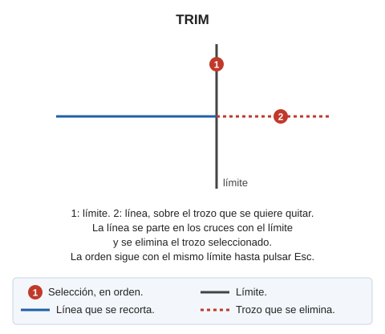

# TRIM
<!-- id: trim -->

Corta una entidad hasta su punto de intersección con el borde de otra.

## Parámetros

No admite parámetros.

Si Digi3D.AI descarta alguno de los trozos nuevos, la orden no corta la entidad y la entidad original se conserva.

## Características de la orden

| Tipo de orden | [Orden interactiva](trim.md) |
| :--- | :--- |
| Repite automáticamente | Si |
| Opción del menú donde aparece la orden | Editar/Polilíneas/Recortar una línea en el cruce con otra línea |
| Barra de herramientas en la que aparece la orden | Extender/Recortar |
| Extensión | DigiNG.OrdenesStandard.dll |
| Variables relacionadas | [REPITE](/digi3d-ai/referencia/ventana-de-dibujo/variables/r/repite.md) — repite la última orden ejecutada |
| Órdenes relacionadas | [ESTIRA\_RECORTA\_POR\_TOLERANCIA](/digi3d-ai/referencia/ventana-de-dibujo/ordenes/e/estira-recorta-por-tolerancia.md) [EXT](/digi3d-ai/referencia/ventana-de-dibujo/ordenes/e/ext.md) [TRIM\_LADO](/digi3d-ai/referencia/ventana-de-dibujo/ordenes/t/trim-lado.md) [TRIM\_M](/digi3d-ai/referencia/ventana-de-dibujo/ordenes/t/trim-m.md) |
| Nombre interno | {5E8BD236-94A0-4b3e-BCB4-461DEE1D52B0} |

## Vídeo

Vea también

