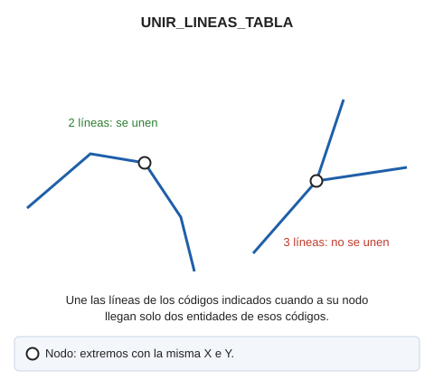

# UNIR\_LINEAS\_TABLA
<!-- id: unir-lineas-tabla -->

Une las lineas en pantalla siempre que al nodo no lleguen más de dos entidades con el mismo código.(siempre que tengan el mismo código y continuidad geométrica) por código.

## Parámetros

| Número de parámetro | Descripción | Opcional |
| :--- | :--- | :--- |
| 1 | Código o códigos (uno o más, separados por espacios) | Si |

Si Digi3D.AI descarta alguna de las líneas nuevas, la orden no une ninguna línea y se conservan todas las originales.

## Características de la orden

| Tipo de orden | [Orden inmediata](unir-lineas-tabla.md) |
| :--- | :--- |
| Repite automáticamente | No |
| Opción del menú donde aparece la orden | _Esta orden no tiene asociada ninguna opción de menú_ |
| Barra de herramientas en la que aparece la orden | _Esta orden no tiene asociado ningún botón en ninguna barra de herramientas_ |
| Extensión | DigiNG.OrdenesTopologia.dll |
| Variables relacionadas | No tiene variables relacionadas |
| Órdenes relacionadas | [UNIR\_LINEAS](/digi3d-ai/referencia/ventana-de-dibujo/ordenes/u/unir-lineas.md) [UNIR\_LINEAS\_VISIBLES\_TABLA](/digi3d-ai/referencia/ventana-de-dibujo/ordenes/u/unir-lineas-visibles-tabla.md) [UNIR\_XYZ\_TABLA](/digi3d-ai/referencia/ventana-de-dibujo/ordenes/u/unir-xyz-tabla.md) |
| Nombre interno | {CD8D1E02-CED4-4EF9-8466-201499CE9A3A} |
