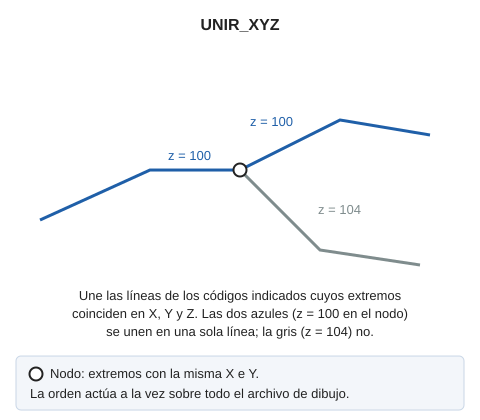

# UNIR\_XYZ
<!-- id: unir-xyz -->

Une las líneas cuyos códigos se pasen por parámetros si en el nodo de unión coincide la coordenada Z

## Parámetros

| Número de parámetro | Descripción | Opcional |
| :--- | :--- | :--- |
| 1 | Código o códigos (uno o más, separados por espacios) | No |

## Observaciones

La orden solo une las líneas visibles que tienen alguno de los códigos pasados como parámetro. Sin códigos, la orden no hace nada y emite el sonido de error.

Cada línea se une como mucho una vez en cada ejecución. Para unir una cadena de más de dos líneas, ejecuta la orden varias veces.

## Características de la orden

| Tipo de orden | [Orden inmediata](unir-xyz.md) |
| :--- | :--- |
| Repite automáticamente | No |
| Opción del menú donde aparece la orden | _Esta orden no tiene asociada ninguna opción de menú_ |
| Barra de herramientas en la que aparece la orden | _Esta orden no tiene asociado ningún botón en ninguna barra de herramientas_ |
| Extensión | DigiNG.OrdenesTopologia.dll |
| Variables relacionadas | No tiene variables relacionadas |
| Órdenes relacionadas | [UNIR\_LINEAS](/digi3d-ai/referencia/ventana-de-dibujo/ordenes/u/unir-lineas.md) [UNIR\_XYZ\_TABLA](/digi3d-ai/referencia/ventana-de-dibujo/ordenes/u/unir-xyz-tabla.md) |
| Nombre interno | {EA135AD0-C148-4861-84EA-9CB29C8F88D0} |
