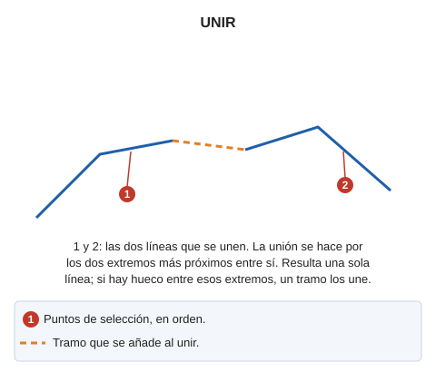

# UNIR
<!-- id: unir -->

Une dos entidades lineales que has de seleccionar, generando un único elemento de dibujo.

## Parámetros

| Número de parámetro | Descripción | Opcional |
| :--- | :--- | :--- |
| 1 | Código de las líneas que se unen por ventana | Si |

Con un código como parámetro (`UNIR=<código>`), la orden une por ventana. Es la opción **Unir polilíneas por ventana y código** del menú:

1. Digitaliza los 4 vértices de una ventana.
2. La orden busca las líneas visibles de ese código que cortan la ventana y une entre sí cada par de esas líneas por el extremo de cada una más cercano a su corte con la ventana, si los dos extremos tienen la misma Z.

Si una de las dos líneas no pertenece al modelo actual, la orden no la modifica: mueve el extremo de la otra línea al extremo de la primera.

## Observaciones

Sin parámetros, la orden pide que selecciones las dos líneas. El punto de selección no decide por qué extremos se unen las líneas. La orden mide en planta las cuatro distancias entre los extremos de la primera línea y los de la segunda, y une las líneas por el par de extremos más próximos entre sí.

Si las dos líneas tienen el mismo código y los mismos atributos de base de datos, la orden las une sin preguntar. En los demás casos:

* Si los códigos son iguales y los atributos de base de datos son distintos, la orden muestra un cuadro de diálogo con los campos que difieren. En él eliges cancelar la unión, unir con los atributos de la primera línea o unir con los atributos de la segunda.
* Si los códigos son distintos, la orden depende de la opción **Si las dos líneas tienen códigos distintos**, de la categoría **Unir** del cuadro de diálogo de configuración:
  * Con el valor **No unir las líneas** (valor por defecto), la orden emite el sonido de error, muestra el mensaje «Se han seleccionado líneas con códigos distintos.» y no une las líneas.
  * Con el valor **Preguntar el código de la línea a generar**, la orden muestra un cuadro de diálogo con los códigos de cada línea. En él eliges los códigos de la primera línea, los de la segunda o no unir las líneas.

## Características de la orden

| Tipo de orden | [Orden interactiva](unir.md) |
| :--- | :--- |
| Repite automáticamente | No |
| Opción del menú donde aparece la orden |Editar/Polilíneas/Unir dos polilíneas ó Editar/Polilíneas/Unir polilíneas por ventana y código|
| Barra de herramientas en la que aparece la orden | Unir |
| Extensión | DigiNG.OrdenesStandard.dll |
| Variables relacionadas | No tiene variables relacionadas |
| Órdenes relacionadas | [EXT2X](/digi3d-ai/referencia/ventana-de-dibujo/ordenes/e/ext2x.md) [UNIR\_COD](/digi3d-ai/referencia/ventana-de-dibujo/ordenes/u/unir-cod.md) |
| Nombre interno | {88F56A67-0638-495d-99FB-6265DAD1CF1B} |

