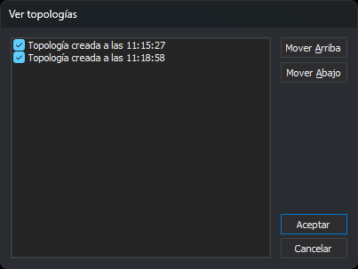

# VER\_TOPOLOGIAS
<!-- id: ver-topologias -->

Muestra u oculta las topologías cargadas y cambia el orden en que se dibujan.

## Parámetros

| Número de parámetro | Descripción | Opcional |
| :--- | :--- | :--- |
| 1 | Nombre de la topología | Sí |
| 2 | Visible: `0` la oculta; cualquier otro número la muestra | Sí |

## Observaciones

Los dos parámetros van juntos. Si solo indicas el nombre, la orden emite el sonido de error y no hace nada. Si el nombre tiene espacios, escríbelo entre comillas. Si no hay ninguna topología cargada con ese nombre, sin distinguir mayúsculas de minúsculas, la orden no cambia nada.

Con parámetros, la orden no muestra el cuadro de diálogo: muestra u oculta la topología indicada y regenera la vista. Las opciones del menú _Topología/Ver_ ejecutan la orden de esta forma: _Todas las topologías_, _Ninguna topología_ y una opción por cada topología cargada, marcada si la topología está visible.

### Ejemplo

`VER_TOPOLOGIAS="Topología creada a las 11:15:27" 0`

### Cuadro de diálogo

Sin parámetros, esta orden solicita en el cuadro _Ver topologías_ qué topologías se ven y en qué orden. Si no hay ninguna topología cargada, la orden emite el sonido de error, muestra el aviso _No se puede modificar ninguna topología porque no hay ningún archivo topológico cargado_ y termina.

La lista contiene las topologías cargadas en su orden de dibujo actual. Cada topología tiene una casilla marcada si está visible.

| Control | Descripción |
| :--- | :--- |
| Lista de topologías | Marca las topologías que quieres ver. Las topologías se dibujan en el orden de la lista, de arriba abajo: cada una se dibuja después de las que tiene encima |
| Mover arriba | Sube una posición la topología seleccionada. Si no hay ninguna seleccionada o ya es la primera, emite el sonido de error |
| Mover abajo | Baja una posición la topología seleccionada. Si no hay ninguna seleccionada o ya es la última, emite el sonido de error |

Al pulsar _Aceptar_, la orden aplica el orden y la visibilidad de la lista, regenera la vista y emite un pitido. Si pulsas _Cancelar_, la orden termina sin cambiar ni el orden ni la visibilidad.

## Características de la orden

| Tipo de orden | Orden inmediata |
| :--- | :--- |
| Repite automáticamente | No |
| Opción del menú donde aparece la orden | Topología/Ver (con parámetros) |
| Barra de herramientas en la que aparece la orden | _Esta orden no tiene asociado ningún botón en ninguna barra de herramientas_ |
| Extensión | DigiNG.OrdenesTopologia.dll |
| Variables relacionadas | No tiene variables relacionadas |
| Órdenes relacionadas | [BINTOP](/digi3d-ai/referencia/ventana-de-dibujo/ordenes/b/bintop.md) |
| Nombre interno | {EA4A64CD-BD28-43B0-A499-C44500C57813} |
