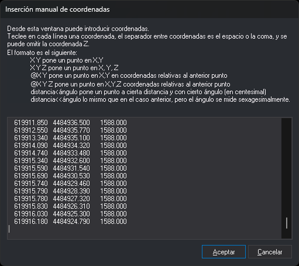

# XY
<!-- id: xy -->

Envía a la orden que se está ejecutando las coordenadas de uno o varios puntos, tecleadas como parámetros o en un cuadro de diálogo.

## Parámetros

| Número de parámetro | Descripción | Valores | Opcional |
| :--- | :--- | :--- | :--- |
| 1, 2, 3 | Coordenadas X, Y y Z del primer punto | Número real | Si |
| 4, 5, 6... | Coordenadas X, Y y Z de los puntos siguientes, de tres en tres | Número real | Si |

Los parámetros son siempre coordenadas absolutas. Si el último punto solo tiene X e Y, su Z es 0; si solo tiene X, la orden lo descarta.

Si no se indican parámetros, o solo se indica uno, la orden muestra el cuadro de diálogo _Inserción manual de coordenadas_.

## Observaciones

La orden envía cada punto a la orden que se está ejecutando como si se hubiera pulsado y soltado el pulsador de datos en esas coordenadas. Después termina.

### Cuadro de diálogo

Teclea un punto por línea. Separa los valores con espacios, tabuladores, comas o el signo `=`. Cada línea admite uno de estos formatos:

| Formato | Significado |
| :--- | :--- |
| `X Y` | Coordenadas absolutas. La Z es la del punto anterior, o 0 si no hay punto anterior |
| `X Y Z` | Coordenadas absolutas con Z |
| `@dX dY` | Incremento respecto al punto anterior, sin cambiar la Z |
| `@dX dY dZ` | Incremento respecto al punto anterior, también en Z |
| `distancia<ángulo` | Distancia y ángulo en grados centesimales respecto al punto anterior, sin cambiar la Z. El ángulo se mide desde el eje X en sentido antihorario |
| `distancia<<ángulo` | Distancia y ángulo en grados sexagesimales respecto al punto anterior, sin cambiar la Z. El ángulo se mide desde el eje X en sentido antihorario |

La orden ignora las líneas vacías, las líneas con un solo valor y los valores que siguen al tercero. Un valor que no es un número cuenta como 0.

El punto anterior de la primera línea es el último vértice de la orden que se está ejecutando. Lo proporcionan [LINEA](/digi3d-ai/referencia/ventana-de-dibujo/ordenes/l/linea.md), [POL](/digi3d-ai/referencia/ventana-de-dibujo/ordenes/p/pol.md), [2P](/digi3d-ai/referencia/ventana-de-dibujo/ordenes/2/2p.md), [3P](/digi3d-ai/referencia/ventana-de-dibujo/ordenes/3/3p.md) y [RECTANGULO\_DR](/digi3d-ai/referencia/ventana-de-dibujo/ordenes/r/rectangulo-dr.md). En las líneas siguientes, el punto anterior es el de la línea anterior.

Si no hay punto anterior, porque no hay ninguna orden en ejecución, porque la orden no proporciona su último vértice o porque todavía no tiene ninguno, la primera línea tiene que ser una coordenada absoluta. Si no lo es, la orden muestra el mensaje _Error: No se admite que el primer punto sea relativo, debe ser absoluto._ y no envía ningún punto.

Si pulsas _Cancelar_, la orden termina sin enviar ningún punto. El contenido del cuadro no se conserva para la siguiente ejecución.

## Características de la orden

| Tipo de orden | [Orden inmediata](xy.md) |
| :--- | :--- |
| Repite automáticamente | No |
| Opción del menú donde aparece la orden | Inmediato/Inserción manual de coordenadas |
| Barra de herramientas en la que aparece la orden | Coordenadas |
| Extensión | DigiNG.OrdenesStandard.dll |
| Variables relacionadas | No tiene variables relacionadas |
| Órdenes relacionadas | [2P](/digi3d-ai/referencia/ventana-de-dibujo/ordenes/2/2p.md) [3P](/digi3d-ai/referencia/ventana-de-dibujo/ordenes/3/3p.md) [LINEA](/digi3d-ai/referencia/ventana-de-dibujo/ordenes/l/linea.md) [POL](/digi3d-ai/referencia/ventana-de-dibujo/ordenes/p/pol.md) [RECTANGULO\_DR](/digi3d-ai/referencia/ventana-de-dibujo/ordenes/r/rectangulo-dr.md) [XYLINEA](/digi3d-ai/referencia/ventana-de-dibujo/ordenes/x/xylinea.md) [XYZLINEA](/digi3d-ai/referencia/ventana-de-dibujo/ordenes/x/xyzlinea.md) |
| Nombre interno | {140CD659-1BAF-4db6-A70B-2DB907255CB2} |
