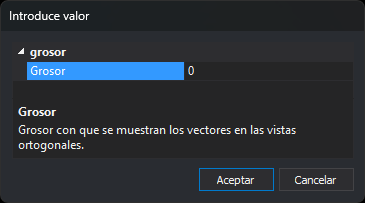

# GROSOR
<!-- id: grosor -->

Suma un grosor adicional a las entidades que se muestran en la ventana de dibujo.

## Parámetros

| Número de parámetro | Descripción | Valores | Opcional |
| :--- | :--- | :--- | :--- |
| 1 | Grosor adicional en píxeles | Número entero, o **?** para consultar el valor actual en un globo | Si |

Si se ejecuta sin parámetros, la orden muestra el cuadro de diálogo **Introduce valor**:

El cuadro se cierra y acepta el valor al pulsar **Intro** o **Escape**, o al confirmar el cambio en el campo.

## Observaciones

El grosor de cada entidad en la ventana de dibujo es su grosor de línea más el valor de esta variable. El grosor de línea es el de la entidad si la entidad tiene uno asignado, o el del código en la tabla de códigos si no lo tiene. El grosor resultante nunca es inferior a 1 píxel, así que un valor negativo adelgaza las entidades hasta ese mínimo.

Al cambiar el valor se regenera la ventana de dibujo. Consultar el valor con `GROSOR=?` no regenera nada.

El valor vale 0 al iniciar Digi3D.AI y no se guarda entre sesiones.

Un parámetro que no es un número se interpreta como 0.

Para cambiar el grosor en la ventana fotogramétrica, utiliza [GROSORS](grosors.md).

### Ejemplos

`GROSOR=2`

Suma 2 píxeles al grosor de las entidades en la ventana de dibujo.

`GROSOR=?`

Muestra el valor actual en un globo.

## Características de la orden

| Tipo de orden | [Variable numérica](../../../ordenes/variables/variables-numericas.md) |
| :--- | :--- |
| Repite automáticamente | No |
| Opción del menú donde aparece la orden | _Esta orden no tiene asociada ninguna opción de menú_ |
| Barra de herramientas en la que aparece la orden | _Esta orden no tiene asociado ningún botón en ninguna barra de herramientas_ |
| Extensión | DigiNG.OrdenesStandard.dll |
| Variables relacionadas | [GROSORS](grosors.md) |
| Nombre interno | {D8D7E7B7-322C-4bbb-9BCD-43B0E71DD457} |
