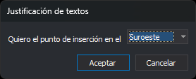

# JT
<!-- id: jt -->

Establece la justificación de texto activa: la posición del punto de inserción respecto al texto que crean las órdenes de dibujo de textos.

## Parámetros

| Número de parámetro | Descripción | Valores | Opcional |
| :--- | :--- | :--- | :--- |
| 1 | Justificación de texto | Número entero de 0 a 8 (ver la tabla siguiente), o **?** para consultar el valor actual en un globo | Si |

| Valor | Posición del punto de inserción |
| :--- | :--- |
| 0 | Suroeste: esquina inferior izquierda |
| 1 | Oeste: centro del lado izquierdo |
| 2 | Noroeste: esquina superior izquierda |
| 3 | Norte: centro del lado superior |
| 4 | Noreste: esquina superior derecha |
| 5 | Este: centro del lado derecho |
| 6 | Sudeste: esquina inferior derecha |
| 7 | Sur: centro del lado inferior |
| 8 | Centro del texto |

Si se ejecuta sin parámetros, la orden muestra el cuadro de diálogo **Justificación de textos**:

El desplegable muestra la justificación activa al abrir el cuadro. **Aceptar** establece como justificación activa la posición seleccionada. **Cancelar** cierra el cuadro sin cambiar el valor.

## Observaciones

Las órdenes que crean textos, como [TEXTO](../../ordenes/t/texto.md), [TEXTO\_R](../../ordenes/t/texto-r.md), [1TEXTO](../../ordenes/1/1-texto.md), [COTA](../../ordenes/c/cota.md), [AREA](../../ordenes/a/area.md), [ROTULA\_CURVAS](../../ordenes/r/rotula-curvas.md), [ROTULA\_Z](../../ordenes/r/rotula-z.md), [CARGA\_T](../../ordenes/c/carga-t.md) o [CARGA\_P](../../ordenes/c/carga-p.md), asignan esta justificación a los textos nuevos. [CAMB\_JT](../../ordenes/c/camb-jt.md) y [CAMB\_JT2](../../ordenes/c/camb-jt2.md) la asignan a textos existentes.

Si [FORZAR\_JT\_ACTIVA](../f/forzar-jt-activa.md) está activada, las órdenes que copian o duplican textos, como [COPIAR](../../ordenes/c/copiar.md), [COPIA\_2P](../../ordenes/c/copia-2p.md) o [COPIA\_R](../../ordenes/c/copia-r.md), almacenan los textos con esta justificación en vez de con la original.

[CLONAR](../../ordenes/c/clonar.md) aplicada sobre un texto establece como justificación activa la de ese texto.

Un valor negativo o mayor que 8 se guarda como 0. Un parámetro que no es un número se interpreta como 0. Si el parámetro empieza por un número, se toma ese número y se ignora el resto.

El valor vale 0 (Suroeste) al iniciar Digi3D.AI y no se guarda entre sesiones.

La opción de menú y los botones de la barra de herramientas ejecutan esta orden con el valor correspondiente y muestran marcado el valor activo.

### Ejemplos

`JT=3`

Sitúa el punto de inserción en el centro del lado superior del texto.

`JT=?`

Muestra la justificación activa en un globo, por ejemplo **Justificación: (3) norte**.

## Características de la orden

| Tipo de orden | [Variable numérica](../../../ordenes/variables/variables-numericas.md) |
| :--- | :--- |
| Repite automáticamente | No |
| Opción del menú donde aparece la orden | Dibujar/Justificación de texto (una opción por valor) |
| Barra de herramientas en la que aparece la orden | Textos (botón desplegable con la barra Justificación de textos, un botón por valor) |
| Extensión | DigiNG.OrdenesStandard.dll |
| Variables relacionadas | [FORZAR\_JT\_ACTIVA](../f/forzar-jt-activa.md) |
| Nombre interno | {77F3855D-5146-436f-AEB1-9468D43AE611} |
