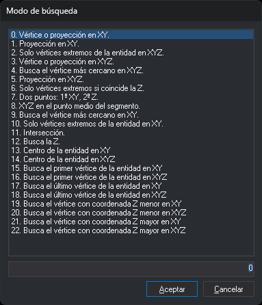

# MODOB
<!-- id: modob -->

Establece el modo de búsqueda: el punto de una entidad del dibujo al que se engancha un tentativo.

## Parámetros

| Número de parámetro | Descripción | Valores | Opcional |
| :--- | :--- | :--- | :--- |
| 1 | Modo de búsqueda principal | Número entero del 0 al 22 | Si |
| 2 y siguientes | Modos de búsqueda secundarios | Números enteros del 0 al 22 | Si |

Si se ejecuta sin parámetros, la orden muestra el cuadro de diálogo **Modo de búsqueda**:

La lista muestra los 23 modos con el modo activo seleccionado. El campo de debajo muestra el número del modo seleccionado. Si se escribe un número en el campo, la lista selecciona ese modo.

**Aceptar** activa el modo seleccionado como único modo de búsqueda y descarta los modos secundarios. Hacer doble clic en un modo equivale a seleccionarlo y pulsar **Aceptar**. Si el campo no contiene un número del 0 al 22, **Aceptar** muestra un aviso y el cuadro no se cierra. **Cancelar** cierra el cuadro sin cambiar el modo y emite un sonido de error.

## Observaciones

Si el primer parámetro está fuera del intervalo de 0 a 22, la orden emite un sonido de error y no cambia el modo. Los modos secundarios fuera de ese intervalo se descartan. Un parámetro que no es un número se interpreta como 0, así que `MODOB=?` activa el modo 0 en lugar de consultar el valor.

El modo vale 0 al iniciar Digi3D.AI y no se guarda entre sesiones. Todas las ventanas de dibujo comparten el mismo modo. El desplegable de la barra de herramientas [Tentativo](../../../barras-de-herramientas/tentativo.md) muestra el modo activo y permite cambiarlo. Con varios modos activos, el desplegable muestra sus números separados por `|`, por ejemplo `12 | 1`.

Para pasar al modo siguiente, utiliza [CAMB\_MODOB](../../ordenes/c/camb-modob.md).

### Ámbito de búsqueda

El tentativo analiza las entidades que pasan a una distancia del cursor menor o igual que el tamaño del cursor más 3 píxeles. El tamaño del cursor se establece con la orden [CURSOR](../../ordenes/c/cursor.md). La distancia se mide en píxeles de pantalla, así que el ámbito en coordenadas del terreno depende del zoom. En el modo 11 la distancia es el tamaño del cursor más 1 píxel.

### Modos secundarios

Con varios modos, el tentativo prueba los modos en el orden de los parámetros en cada entidad del ámbito y usa el primero que encuentra un punto. Si ningún modo encuentra un punto en esa entidad, el tentativo pasa a la siguiente entidad del ámbito.

Los modos 7 y 11 solo funcionan como modo único. En una lista de varios modos no encuentran ningún punto.

### Coordenada Z

En los modos XY, el punto toma la X y la Y de la entidad y la Z del cursor. En los modos XYZ, el punto toma las tres coordenadas de la entidad. Si la variable [FIJAZ](../f/fijaz.md) está activada, el punto toma el valor de la variable [Z](../z/z.md) en todos los modos.

### Modos de búsqueda

| Valor | Nombre | Descripción |
| :--- | :--- | :--- |
| 0 | Vértice o proyección en XY | Si hay un vértice de la entidad dentro del ámbito, se engancha a ese vértice. Si no lo hay, se engancha a la proyección del cursor sobre el segmento más cercano. |
| 1 | Proyección o vértice en XY | Se engancha a la proyección del cursor sobre el segmento más cercano si esa proyección está dentro del ámbito. Si no lo está, se engancha al vértice más cercano. |
| 2 | Vértices extremos de la entidad en XYZ | Se engancha al primer vértice de la entidad si está dentro del ámbito y, si no lo está, al último. Si ninguno de los dos está dentro del ámbito, no se engancha a esa entidad. |
| 3 | Vértice o proyección en XYZ | Igual que el modo 0, con la Z de la entidad en el punto de enganche. |
| 4 | Vértice más cercano en XYZ | Se engancha al vértice más cercano al cursor. Si el cursor está más cerca de un segmento que de cualquier vértice, se engancha al extremo de ese segmento más cercano al cursor, aunque ese extremo quede fuera del ámbito. |
| 5 | Proyección o vértice en XYZ | Igual que el modo 1, con la Z de la entidad en el punto de enganche. |
| 6 | Vértices extremos con la Z del cursor en XYZ | Igual que el modo 2, pero solo se engancha si la Z del vértice es igual a la Z del cursor. Sirve para continuar una curva de nivel con su misma Z. |
| 7 | XY del último vértice y Z del cursor | No busca entidades. Durante las órdenes [LINEA](../../ordenes/l/linea.md) y [SELECCIONA\_POLIGONO](../../ordenes/s/selecciona-poligono.md), el tentativo registra un punto con la X y la Y del último vértice registrado y la Z del cursor. Si todavía no hay ningún vértice, emite un sonido de error. Fuera de esas órdenes, el tentativo no se engancha a nada. |
| 8 | Punto medio del segmento en XYZ | En las líneas, se engancha al punto medio del segmento más cercano al cursor. En el resto de entidades, se engancha al vértice más cercano. |
| 9 | Vértice más cercano en XY | Igual que el modo 4, con la Z del cursor. |
| 10 | Vértices extremos de la entidad en XY | Igual que el modo 2, con la Z del cursor. |
| 11 | Intersección de dos líneas | Se engancha a la intersección de dos líneas. Ver [Modo 11](#modo-11-intersección-de-dos-líneas). |
| 12 | Punto de la línea con la Z del cursor | En las líneas con un segmento dentro del ámbito, calcula los puntos de la línea cuya Z es igual a la Z del cursor, interpolando entre vértices, y se engancha al más cercano al cursor en XY. Si la línea no alcanza esa Z, no se engancha. En el resto de entidades, se engancha al vértice más cercano en XYZ. Sirve para hacer pasar una curva de nivel por una línea 3D, como un río o un camino. |
| 13 | Centro de la entidad en XY | Se engancha al centro del rectángulo envolvente de la entidad, aunque ese centro quede fuera del ámbito. |
| 14 | Centro de la entidad en XYZ | Igual que el modo 13. La Z es la media entre la Z mínima y la Z máxima de la entidad. |
| 15 | Primer vértice de la entidad en XY | Se engancha al primer vértice de la entidad, aunque quede fuera del ámbito. |
| 16 | Primer vértice de la entidad en XYZ | Igual que el modo 15, con la Z del vértice. |
| 17 | Último vértice de la entidad en XY | Se engancha al último vértice de la entidad, aunque quede fuera del ámbito. |
| 18 | Último vértice de la entidad en XYZ | Igual que el modo 17, con la Z del vértice. |
| 19 | Vértice de Z mínima en XY | Se engancha al vértice de menor Z de la entidad. Si hay varios, se engancha al primero. |
| 20 | Vértice de Z mínima en XYZ | Igual que el modo 19, con la Z del vértice. |
| 21 | Vértice de Z máxima en XY | Se engancha al vértice de mayor Z de la entidad. Si hay varios, se engancha al primero. |
| 22 | Vértice de Z máxima en XYZ | Igual que el modo 21, con la Z del vértice. |

En los modos 13 a 22 basta con que la entidad pase por el ámbito de búsqueda. El punto de enganche puede estar fuera del ámbito.

### Modo 11: intersección de dos líneas

Con el modo 11 como único modo, el tentativo busca las líneas visibles que tienen algún segmento dentro del ámbito y las parejas de esas líneas que se cortan dentro del ámbito. Solo considera entidades de tipo línea. Si no hay al menos dos líneas que se corten dentro del ámbito, emite un sonido de error.

El punto toma la X y la Y de la intersección más cercana al cursor y la Z de la primera línea. Cada nueva pulsación del botón de tentativo cambia la propuesta: primero a la Z de la segunda línea y después a la siguiente pareja de líneas. Cuando no quedan parejas, el tentativo emite un sonido de error y termina. El botón de dato acepta el punto.

### Modo de búsqueda automático

Si [AUTOMODOB](../../ordenes/a/automodob.md) está activada y hay una tabla cargada con [PARAMETROS\_AUTO\_MODOB](../../ordenes/p/parametros-auto-modob.md), el tentativo sustituye el modo de búsqueda por el que la tabla asigna al código activo y al código de cada entidad analizada. Si la tabla no tiene ninguna fila para esa combinación, el tentativo activa el modo 0. Si además [AUTOMODOB\_EXHAUSTIVO](../../ordenes/a/automodob-exhaustivo.md) está activada, el tentativo descarta esa entidad en lugar de activar el modo 0. El modo que deja el tentativo sigue activo después.

### Ejemplos

`MODOB=4`

Activa el modo 4.

`MODOB=12 1`

Activa el modo 12 con el modo 1 como secundario. En las entidades en las que el modo 12 no encuentra un punto con la Z del cursor, el tentativo se engancha a la proyección o al vértice en XY.

## Características de la orden

| Tipo de orden | [Orden no interactiva](../../../ordenes/ordenes-no-interactivas.md) |
| :--- | :--- |
| Repite automáticamente | No |
| Opción del menú donde aparece la orden | _Esta orden no tiene asociada ninguna opción de menú_ |
| Barra de herramientas en la que aparece la orden | [Tentativo](../../../barras-de-herramientas/tentativo.md) (desplegable de modo de búsqueda) |
| Extensión | DigiNG.OrdenesStandard.dll |
| Variables relacionadas | [CAMB\_MODOB](../../ordenes/c/camb-modob.md) [AUTOMODOB](../../ordenes/a/automodob.md) [CURSOR](../../ordenes/c/cursor.md) [FIJAZ](../f/fijaz.md) |
| Nombre interno | {4B0321A1-67A4-4209-89A9-3F55C6AB2539} |
