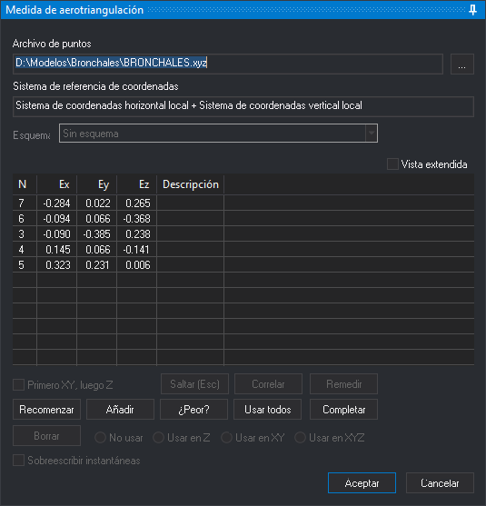

# AEROTRI
<!-- id: aerotri -->

Mide los puntos de aerotriangulación y de apoyo del modelo cargado en la ventana fotogramétrica y guarda sus coordenadas modelo y sus fotocoordenadas para un programa de cálculo de aerotriangulación.

## Parámetros

No admite parámetros.

## Panel Medida de aerotriangulación

Esta orden muestra este panel y el panel [Instantáneas](../../../paneles/instantaneas.md). Antes de abrir el panel, la orden carga el archivo de puntos de apoyo. Si no lo puede leer, muestra «Advertencia: No se pudo cargar el archivo de puntos de apoyo» y abre el cuadro de diálogo [Archivo de puntos de apoyo](../../../cuadros-de-dialogo/archivo-de-puntos-de-apoyo.md). Si cancelas ese cuadro de diálogo, la orden termina.

El panel es el de [ORI\_ABSOLUTA](../o/ori-absoluta.md) con estas diferencias:

* **Esquema**: el esquema de aerotriangulación con el que se recorren los puntos. Los esquemas se leen del archivo indicado en [Esquemas](../../../cuadros-de-dialogo/configuracion/medida-de-aerotriangulacion/esquemas.md), en la configuración de la medida de aerotriangulación. Cada punto del esquema tiene un prefijo, una posición en la foto y un sufijo. El nombre del punto es el prefijo, el nombre de la foto y el sufijo. El esquema se aplica primero a la foto izquierda y después a la derecha. Al elegir un esquema, el panel lleva el cursor a la posición del primer punto sin medir y ejecuta [CORRELAR](../c/correlar.md). Digi3D.AI recuerda el último esquema elegido.
  * Si el modelo ya tiene un archivo _.mod_ de una medida anterior, el panel carga sus puntos y desactiva **Esquema**.
  * Si no hay ningún archivo de esquemas configurado, **Esquema** queda vacío y los puntos se miden con **Añadir**.
  * Si el archivo de esquemas no se puede leer, la orden muestra «Error en el formato del archivo de esquemas» y termina.
* **Añadir**: abre el cuadro de diálogo [Introduce un punto terreno del archivo de puntos](../../../cuadros-de-dialogo/introduce-punto-terreno.md). Si el nombre que escribes no está en el archivo de puntos de apoyo, el punto se mide como punto de aerotriangulación: no tiene coordenadas terreno, no tiene residuos y no se puede cambiar su uso con **No usar**, **Usar en Z**, **Usar en XY** ni **Usar en XYZ**.
* Si un punto ya está medido en las fotos de otro modelo, el panel lleva el cursor a su posición a partir de esas fotocoordenadas.
* Cuando terminan los puntos del esquema y hay al menos dos puntos de apoyo medidos, el panel sigue con los puntos del archivo de puntos de apoyo que caen dentro del modelo.
* **Aceptar** está disponible aunque no haya puntos medidos, salvo mientras se vuelve a medir un punto.

Al aceptar, Digi3D.AI escribe en la carpeta **Aerotriangulación** del proyecto:

* Un archivo _nombre del modelo.mod_ con las coordenadas modelo multiplicadas por 1000 de los dos centros de proyección y de los puntos medidos que no están en **No usar**.
* Un archivo de fotocoordenadas por foto, con los puntos medidos en ella.

La orientación absoluta que el panel calcula con los puntos de apoyo solo sirve para llevar el cursor a los puntos. Al cerrar el panel, con **Aceptar** o con **Cancelar**, el modelo recupera la orientación absoluta que tenía.

## Características de la orden

| Tipo de orden | Orden interactiva |
| :--- | :--- |
| Repite automáticamente | No |
| Opción del menú donde aparece la orden | Ventana fotogramétrica/Medida de aerotriangulación (opción que añade el sensor de cámara cónica) |
| Barra de herramientas en la que aparece la orden | _Esta orden no tiene asociado ningún botón en ninguna barra de herramientas_ |
| Extensión | Digi3D.ConicSensor.dll |
| Variables relacionadas | No tiene variables relacionadas |
| Órdenes relacionadas | [ORI\_ABSOLUTA](/digi3d-ai/referencia/ventana-fotogrametrica/ordenes/o/ori-absoluta.md) [CORRELAR](/digi3d-ai/referencia/ventana-fotogrametrica/ordenes/c/correlar.md) |
| Nombre interno | {3992CC17-D66C-4998-9B6E-FE69E0E4D4F7} |
