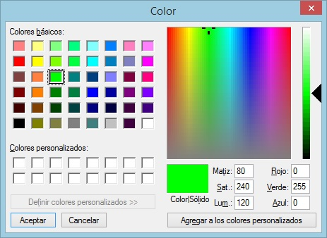

# COLOR\_ÍNDICE

Permite cambiar el color de los índices en la pantalla estereoscópica.

## Parámetros

| Número de parámetro | Descripción | Opcional |
| :--- | :--- | :--- |
| 1 | Componente roja del color, de 0 a 255 | Sí |
| 2 | Componente verde del color, de 0 a 255 | Sí |
| 3 | Componente azul del color, de 0 a 255 | Sí |

Sin parámetros, la orden muestra el cuadro de diálogo de selección de color. Con los tres parámetros, la orden asigna ese color a los dos índices sin mostrar el cuadro de diálogo. Con uno o dos parámetros, la orden no cambia el color y suena la música de error.

### Ejemplo

`COLOR_INDICE=0 255 0`

## Observaciones

Al ejecutar la orden sin parámetros aparecerá la siguiente ventana en la cual el usuario podrá seleccionar el color:

El color elegido se aplica a los dos índices.

## Características de la orden

| Tipo de orden | Orden interactiva sin parámetros; orden inmediata con parámetros |
| :--- | :--- |
| Repite automáticamente | No |
| Opción del menú donde aparece la orden | Ventana fotogramétrica/Índices/Color |
| Barra de herramientas en la que aparece la orden | _Esta orden no tiene asociado ningún botón en ninguna barra de herramientas_ |
| Extensión | Digi3D.CommonCommands.dll |
| Variables relacionadas | No tiene variables relacionadas |
| Órdenes relacionadas | [CAMBIA\_BRILLO\_ÍNDICE](/digi3d-ai/referencia/ventana-fotogrametrica/ordenes/c/cambia-brillo-indice.md) |
| Nombre interno | {F3F80700-4479-45ff-89D2-10E8F5C12F3E} |

