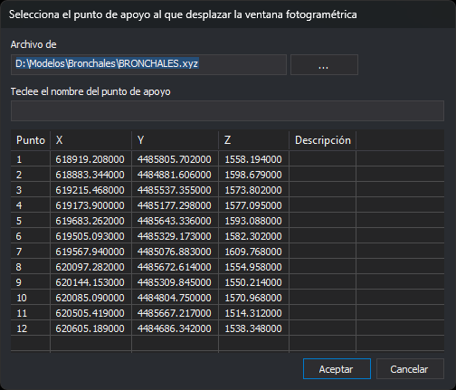

# IR\_A\_PUNTO\_APOYO
<!-- id: ir-a-punto-apoyo -->

Mueve el restituidor a un punto de apoyo elegido de un archivo de puntos.

## Parámetros

No admite parámetros.

## Observaciones

La orden lee la ruta del archivo de puntos del valor de registro `ArchivoPuntos`, el mismo que usa la pestaña [Sensores fotogramétricos](/digi3d-ai/referencia/cuadros-de-dialogo/nuevo-proyecto/sensores-fotogrametricos.md) del cuadro de diálogo **Nuevo proyecto**. Si el valor está vacío o el archivo no existe, la orden muestra el cuadro de diálogo de Windows para abrir un archivo y guarda la ruta elegida en ese valor. Si se cancela, la orden termina con la música de error.

Después la orden solicita el punto en el cuadro de diálogo **Selecciona el punto de apoyo al que desplazar la ventana fotogramétrica**.

* **Archivo de puntos de apoyo**: ruta del archivo cargado. El botón **...** abre el cuadro de diálogo **Selecciona archivo de puntos de apoyo** para cargar otro archivo, y guarda la ruta elegida en el valor `ArchivoPuntos`.
* **Escribe el nombre del punto de apoyo o selecciónalo en la lista**: al escribir, la lista selecciona el punto que se llama exactamente así o, si no hay ninguno, el primero cuyo nombre empieza por el texto escrito. No distingue mayúsculas de minúsculas. Si ningún nombre empieza por el texto, la lista se queda sin selección.
* Lista de puntos: columnas **Punto**, **X**, **Y**, **Z** y **Descripción**. Cada línea del archivo con al menos cuatro datos \(nombre, X, Y y Z\) es un punto; el resto de la línea, si existe, es la descripción. Las demás líneas se ignoran.

Al abrirse, el cuadro de diálogo tiene el foco en el campo del nombre. Para ir a un punto, escribe su nombre o selecciónalo en la lista y pulsa **Aceptar** o **Intro**, o haz doble clic sobre él. Si no hay ningún punto seleccionado, suena un aviso y el cuadro de diálogo sigue abierto.

La orden mueve el restituidor a las coordenadas terreno del punto y suena un pitido. Si se cancela el cuadro de diálogo, la orden termina con la música de error.

La orden no comprueba si las orientaciones relativa y absoluta están realizadas.

El cuadro de diálogo se puede redimensionar y guarda su tamaño y su posición.

## Características de la orden

| Tipo de orden | Orden interactiva |
| :--- | :--- |
| Repite automáticamente | No |
| Opción del menú donde aparece la orden | Ventana fotogramétrica/Ir a punto de apoyo... |
| Barra de herramientas en la que aparece la orden | _Esta orden no tiene asociado ningún botón en ninguna barra de herramientas_ |
| Extensión | Digi3D.CommonCommands.dll |
| Variables relacionadas | No tiene variables relacionadas |
| Órdenes relacionadas | [IR\_A](/digi3d-ai/referencia/ventana-de-dibujo/ordenes/i/ir-a.md) [IR\_A\_PUNTO\_ORIGEN](/digi3d-ai/referencia/ventana-fotogrametrica/ordenes/i/ir-a-punto-origen.md) |
| Nombre interno | {9FCD076A-DD12-42a7-980E-FC2392C95419} |
