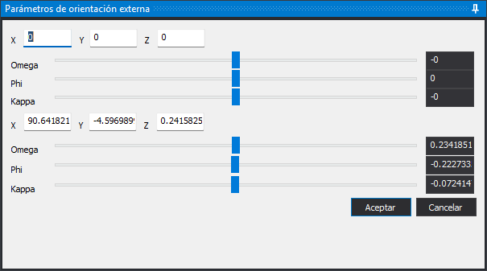

# MODIFICAR\_PARAMETROS\_MODELO
<!-- id: modificar-parametros-modelo -->

Modifica a mano la posición y los giros de las dos cámaras del modelo de cámara cónica cargado en la ventana fotogramétrica. Los cambios se ven en las imágenes mientras se editan.

## Parámetros

No admite parámetros.

## Panel Modificar orientación del modelo

El panel tiene un grupo de controles para la **Cámara izquierda** y otro para la **Cámara derecha**. Los valores iniciales son los de la orientación relativa del modelo.

* **X**, **Y**, **Z**: coordenadas del centro de proyección de la cámara, en el sistema de coordenadas del modelo.
* **Omega**, **Phi**, **Kappa**: giros de la cámara en grados sexagesimales, aplicados en el orden omega, phi, kappa. Cada giro tiene un deslizador y un campo. Los giros van de -180 a 180 grados. El deslizador avanza en pasos de 0,01 grados; en el campo se puede escribir cualquier valor de ese intervalo.

Cada cambio se aplica a las imágenes en el momento, tanto al mover un deslizador como al escribir un valor válido en un campo. Mientras el texto de un campo no es un número, o un giro está fuera del intervalo, por ejemplo mientras escribes el signo de un valor negativo, las imágenes no cambian.

* **Aceptar**: valida los doce campos y termina la orden. Si algún campo no es válido, aparece un mensaje y el panel sigue abierto. La orientación modificada se usa mientras el modelo está cargado; no se guarda en los archivos de orientación.
* **Cancelar**: devuelve las dos cámaras a la orientación que tenían al ejecutar la orden y termina la orden.

Si hay otra orden ejecutándose encima del panel, **Aceptar** y **Cancelar** emiten el sonido de error y no hacen nada hasta que esa orden termina.

## Características de la orden

| Tipo de orden | Orden interactiva |
| :--- | :--- |
| Repite automáticamente | No |
| Opción del menú donde aparece la orden | Ventana fotogramétrica/Orientaciones/Modificar orientación del modelo (opción que añade el sensor de cámara cónica) |
| Barra de herramientas en la que aparece la orden | _Esta orden no tiene asociado ningún botón en ninguna barra de herramientas_ |
| Extensión | Digi3D.ConicSensor.dll |
| Variables relacionadas | No tiene variables relacionadas |
| Órdenes relacionadas | [ORI\_RELATIVA](/digi3d-ai/referencia/ventana-fotogrametrica/ordenes/o/ori_relativa.md) [ROTACIONES\_CAMARAS](/digi3d-ai/referencia/ventana-fotogrametrica/ordenes/r/rotaciones-camaras.md) |
| Nombre interno | {22F02A11-BB26-444D-89B3-43D0F41803CB} |
