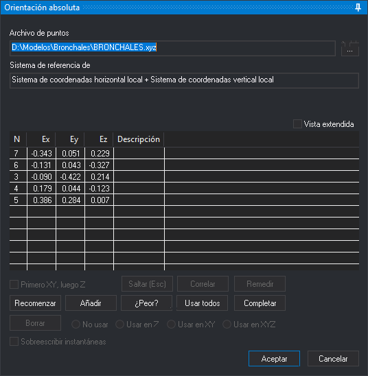

# ORI\_ABSOLUTA
<!-- id: ori-absoluta -->

Realiza la **Orientación Absoluta** del modelo cargado en la ventana fotogramétrica.

## Parámetros

No admite parámetros.

## Panel Orientación absoluta

Esta orden muestra este panel, en el que se miden los puntos de apoyo y se ven los residuos de la orientación. Los botones que no se pueden usar en cada momento aparecen desactivados.

* **Archivo de puntos**: archivo con las coordenadas terreno de los puntos de apoyo. El botón **...** abre el cuadro de diálogo [Archivo de puntos de apoyo](../../../cuadros-de-dialogo/archivo-de-puntos-de-apoyo.md) para cambiarlo.
* **Sistema de referencia de coordenadas**: el sistema de las coordenadas del archivo de puntos.
* **Vista extendida**: añade a la lista las coordenadas terreno (**X**, **Y**, **Z**) y modelo (**Xmod**, **Ymod**, **Zmod**) de cada punto. Digi3D.AI recuerda su estado.
* **Lista de puntos medidos**: el nombre de cada punto (**N**), sus residuos en X, Y y Z (**Ex**, **Ey**, **Ez**) y su **Descripción**. Hacer doble clic en un punto lleva el cursor a él para volver a medirlo.
* **Primero XY, luego Z**: el punto se mide en dos pasos: el primer dato registra la posición en planta y el segundo, la Z.
* **Saltar (Esc)**: mientras se espera la medida de un punto, lo descarta y pasa al siguiente. Con un punto seleccionado en la lista, quita la selección.
* **Correlar**: ejecuta la orden CORRELAR para ajustar automáticamente la posición en la otra imagen.
* **Remedir**: lleva el cursor al punto seleccionado en la lista para volver a medirlo.
* **Recomenzar**: vuelve a medir, uno a uno, todos los puntos.
* **Añadir**: mide un punto nuevo. Abre el cuadro de diálogo [Introduce un punto terreno del archivo de puntos](../../../cuadros-de-dialogo/introduce-punto-terreno.md) para elegirlo.
* **¿Peor?**: selecciona el punto con el residuo más grande. Necesita al menos tres puntos medidos.
* **Usar todos**: vuelve a usar en X, Y y Z todos los puntos medidos.
* **Completar**: recorre los puntos del archivo que quedan por medir.
* **Borrar**: elimina el punto seleccionado y vuelve a calcular la orientación.
* **No usar**, **Usar en Z**, **Usar en XY** y **Usar en XYZ**: qué coordenadas del punto seleccionado intervienen en el cálculo.
* **Sobreescribir instantáneas**: al medir un punto, Digi3D.AI guarda una instantánea de cada imagen en la carpeta de instantáneas del proyecto. Con la casilla marcada sustituye las que ya existan; sin marcar, solo crea las que faltan.
* **Aceptar**: guarda la orientación y termina la orden. Solo está disponible cuando hay puntos suficientes para calcularla.
* **Cancelar**: termina la orden sin guardar la orientación.

## Características de la orden

| Tipo de orden | Orden interactiva |
| :--- | :--- |
| Repite automáticamente | No |
| Opción del menú donde aparece la orden | Ventana fotogramétrica/Orientación absoluta (opción que añade el sensor de cámara cónica) |
| Barra de herramientas en la que aparece la orden | _Esta orden no tiene asociado ningún botón en ninguna barra de herramientas_ |
| Extensión | Digi3D.ConicSensor.dll |
| Variables relacionadas | No tiene variables relacionadas |
| Órdenes relacionadas | [ORI\_INTERNA\_D](/digi3d-ai/referencia/ventana-fotogrametrica/ordenes/o/ori-interna-d.md) [ORI\_INTERNA\_I](/digi3d-ai/referencia/ventana-fotogrametrica/ordenes/o/ori-interna-i.md) [ORI\_RELATIVA](/digi3d-ai/referencia/ventana-fotogrametrica/ordenes/o/ori_relativa.md) |
| Nombre interno | {08BBBC9A-950E-4701-A953-A6582BF75729} |

