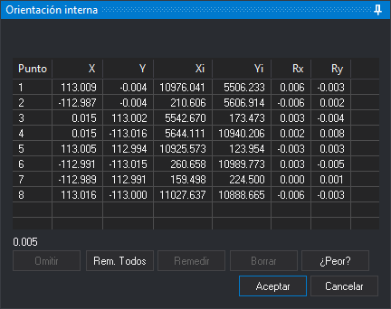

# ORI\_INTERNA\_I
<!-- id: ori-interna-i -->

Realiza la **orientación interna** de la imagen izquierda del modelo cargado en la ventana fotogramétrica. La orientación interna relaciona las coordenadas fiduciales del certificado de calibración de la cámara con las coordenadas píxel de las marcas fiduciales en la imagen. La orden [ORI\_INTERNA\_D](/digi3d-ai/referencia/ventana-fotogrametrica/ordenes/o/ori-interna-d.md) hace lo mismo con la imagen derecha y usa el mismo panel.

## Parámetros

No admite parámetros.

## Requisitos

La orden muestra un globo de error y termina en estos casos:

* El sensor del modelo no es el de cámara cónica.
* La cámara de la imagen no es analógica, es decir, no tiene marcas fiduciales.
* La orientación interna existente es de solo lectura porque no se encontró el archivo con las marcas medidas.
* Se está ejecutando otra orden de orientación.

## Panel Orientación interna

Mientras el panel está abierto, Digi3D.AI muestra la imagen que se orienta en los dos ojos, pone el factor de zoom a 1 y deshabilita el botón de cerrar la ventana fotogramétrica. En la parte inferior del panel se indica la marca fiducial que hay que digitalizar. Cada marca se registra al pulsar cualquier botón del ratón o del dispositivo de entrada.

Si la imagen ya tenía una orientación interna medida, el panel se abre con las marcas medidas entonces. Si la imagen no la tenía y la otra imagen del modelo sí, Digi3D.AI busca cada marca por correlación a partir de la marca medida en la otra imagen. La barra de estado muestra **Correlando marca fiducial: N** y el porcentaje. Si la correlación no encuentra una marca, se detiene y el panel pide esa marca y las siguientes para medirlas a mano. Si encuentra todas y la opción **Al correlar ir al peor punto** de la configuración está activa, el panel ejecuta **¿Peor?**.

* **Relojes**: posición de los relojes (**Izquierda**, **Arriba**, **Derecha** o **Abajo**) en la imagen. Digi3D.AI la usa para llevar el cursor a las dos primeras marcas. Solo aparece antes de medir la primera marca y si la otra imagen no tiene orientación interna. Al cambiarla se empiezan a medir de nuevo todas las marcas.
* **Lista de marcas**: el número de cada marca (**Punto**), sus coordenadas fiduciales (**X**, **Y**), sus coordenadas píxel medidas (**Xi**, **Yi**) y los residuos (**Rx**, **Ry**) en las unidades de las coordenadas fiduciales. Al hacer clic en una marca, el cursor va a ella. Si la opción **Auto remedir** de la configuración está activa, además se empieza a remedir la marca.
* **Desviación estándar**: desviación estándar del ajuste, en las unidades de las coordenadas fiduciales. Se muestra a partir de cuatro marcas medidas.
* **Omitir**: mientras se miden las marcas, salta la marca pedida; esa marca no interviene en el cálculo. Mientras se remide una marca, cancela la medida. También se ejecuta con **Esc**.
* **Rem. todos**: borra las marcas medidas y empieza a medirlas desde la primera.
* **Remedir**: vuelve a medir la marca seleccionada. Está deshabilitado si la opción **Auto remedir** está activa. Mientras se mueve el cursor, la lista muestra los residuos que daría la nueva posición.
* **Borrar**: deja la marca seleccionada como omitida: borra sus coordenadas medidas y sus residuos, y la marca deja de intervenir en el cálculo.
* **¿Peor?**: selecciona la marca con el residuo más grande y lleva el cursor a ella.
* **Aceptar**: calcula la orientación interna con las marcas medidas, la guarda en el archivo `<imagen>.in.xml` del directorio de trabajo y termina la orden. Si la otra imagen no tiene orientación interna, le asigna también esta. Está habilitado cuando se han medido u omitido todas las marcas y hay al menos tres medidas. También se ejecuta con **Ctrl+Intro**.
* **Cancelar**: termina la orden y la imagen conserva la orientación interna que tenía.

### Cálculo de la orientación interna

* Con dos marcas medidas, Digi3D.AI calcula una transformación de semejanza provisional, que sirve para llevar el cursor a las marcas siguientes.
* Con tres o más marcas medidas, calcula una transformación afín. La afín necesita al menos tres marcas que no estén alineadas.
* Si el cálculo no es posible, por ejemplo con tres marcas alineadas, Digi3D.AI muestra el mensaje **La transformación afín necesita al menos tres puntos que no estén alineados, tanto en los puntos origen como en los puntos destino.** y la imagen conserva la orientación interna anterior. Si ocurre al pulsar **Aceptar**, el panel sigue abierto para remedir u omitir marcas.

### Teclas

| Botón | Teclado en español | Teclado en inglés |
| :--- | :--- | :--- |
| **Omitir** | O | B |
| **Rem. todos** | T | A |
| **Borrar** | B | D |
| **¿Peor?** | P | W |

## Características de la orden

| Tipo de orden | Orden interactiva |
| :--- | :--- |
| Repite automáticamente | No |
| Opción del menú donde aparece la orden | Ventana fotogramétrica/Orientaciones/Orientación interna (izquierda) (opción que añade el sensor de cámara cónica) |
| Barra de herramientas en la que aparece la orden | _Esta orden no tiene asociado ningún botón en ninguna barra de herramientas_ |
| Extensión | Digi3D.ConicSensor.dll |
| Variables relacionadas | No tiene variables relacionadas |
| Órdenes relacionadas | [ORI\_ABSOLUTA](/digi3d-ai/referencia/ventana-fotogrametrica/ordenes/o/ori-absoluta.md) [ORI\_INTERNA\_D](/digi3d-ai/referencia/ventana-fotogrametrica/ordenes/o/ori-interna-d.md) [ORI\_RELATIVA](/digi3d-ai/referencia/ventana-fotogrametrica/ordenes/o/ori_relativa.md) |
| Nombre interno | {DFA42290-2F06-4afe-B852-24447ECA6A89} |
