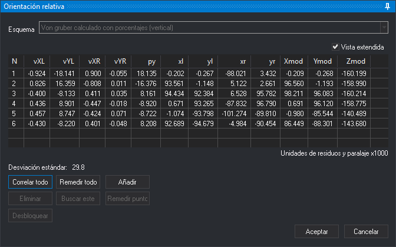

# ORI\_RELATIVA
<!-- id: ori-relativa -->

Realiza la **orientación relativa** del modelo cargado en la ventana fotogramétrica: calcula la posición y los giros de la cámara derecha respecto a la izquierda a partir de puntos homólogos medidos en las dos imágenes.

## Parámetros

No admite parámetros.

## Requisitos

La orden muestra un globo o un mensaje de error y termina en estos casos:

* Se está ejecutando otra orden de orientación.
* El modelo tiene una orientación absoluta. Para remedir la relativa hay que eliminar antes el archivo de orientación absoluta.
* La orientación relativa actual no es modificable.
* No se ha indicado el archivo de esquemas de Von Gruber en la opción **Esquemas** de la categoría **Orientación relativa** de la configuración, o el archivo tiene un error de formato.

## Panel Orientación relativa

Al abrir el panel, si el modelo no tiene orientación relativa y la opción **Calcular recubrimiento por correlación** de la configuración está activa, Digi3D.AI correla el centro de las dos imágenes para calcular el recubrimiento. La barra de estado muestra **Calculando recubrimiento horizontal/vertical**.

Cada punto se mide en dos pasos, como indica el texto de la parte inferior del panel:

1. Digitaliza el punto en la imagen izquierda. Digi3D.AI bloquea la imagen izquierda y busca por correlación el punto homólogo en la imagen derecha.
2. Digitaliza el punto homólogo en la imagen derecha. Pulsa **Esc** para volver al primer paso de ese punto.

Digi3D.AI calcula la orientación relativa cuando hay tantos puntos medidos como indica la opción **Puntos para calcular** de la configuración (5 por omisión), y la vuelve a calcular con cada punto nuevo. Con un solo punto medido ajusta una orientación provisional que elimina la paralaje en ese punto.

* **Esquema**: esquema de Von Gruber con las posiciones aproximadas de los puntos que se piden. Los esquemas se leen del archivo de esquemas. Digi3D.AI recuerda el esquema elegido. Al cambiarlo se borran los puntos medidos. Está deshabilitado si el modelo ya tenía una orientación relativa calculada.
* **Vista extendida**: añade a la lista las coordenadas foto de cada punto en la imagen izquierda (**xl**, **yl**) y en la derecha (**xr**, **yr**) y sus coordenadas modelo (**Xmod**, **Ymod**, **Zmod**). Digi3D.AI recuerda su estado.
* **Lista de puntos**: el número de cada punto (**N**), sus residuos en la imagen izquierda (**vXL**, **vYL**) y en la derecha (**vXR**, **vYR**) y la paralaje en Y (**py**). Los residuos y la paralaje están multiplicados por 1000, como indica el texto **Unidades de residuos y paralaje x1000**. Al hacer clic en un punto, el cursor va a él. Si la opción **Auto remedir** de la configuración está activa, además se empieza a remedir el punto.
* **Desviación estándar**: desviación estándar de la orientación relativa, multiplicada por 1000.
* **Correlar todo**: abre el cuadro de diálogo [Orientación relativa automática por correlación](/digi3d-ai/referencia/cuadros-de-dialogo/orientacion-relativa-automatica-por-correlacion.md), que mide los puntos por correlación. Al terminar, la lista contiene los puntos correlados que intervienen en el cálculo.
* **Remedir todo**: borra los puntos medidos y vuelve a pedirlos desde el primero.
* **Añadir**: pide un punto nuevo en la posición actual del cursor. Está habilitado cuando se han medido todos los puntos.
* **Eliminar**: elimina el punto seleccionado y vuelve a calcular la orientación.
* **Buscar este**: mientras se espera el punto de la imagen derecha, busca por correlación el homólogo del punto medido en la izquierda. Si el factor de correlación es menor que la opción **Factor de correlación** de la configuración, suena el sonido de error.
* **Remedir punto**: vuelve a medir el punto seleccionado. Necesita que estén medidos todos los puntos.
* **Desbloquear**: mientras se mide un punto, vuelve al paso anterior y desbloquea la imagen izquierda. Equivale a **Esc**.
* **Aceptar**: guarda la orientación relativa en el archivo de orientación relativa del modelo y termina la orden. Está habilitado cuando hay puntos suficientes para calcularla. También se ejecuta con **Ctrl+Intro**.
* **Cancelar**: termina la orden y el modelo conserva la orientación relativa que tenía.

### Teclas

| Botón | Teclado en español | Teclado en inglés |
| :--- | :--- | :--- |
| **Remedir todo** | R | R |
| **Añadir** | A | A |
| **Buscar este** | B | S |
| **Remedir punto** | P | P |

## Características de la orden

| Tipo de orden | Orden interactiva |
| :--- | :--- |
| Repite automáticamente | No |
| Opción del menú donde aparece la orden | Ventana fotogramétrica/Orientaciones/Orientación relativa (opción que añade el sensor de cámara cónica) |
| Barra de herramientas en la que aparece la orden | _Esta orden no tiene asociado ningún botón en ninguna barra de herramientas_ |
| Extensión | Digi3D.ConicSensor.dll |
| Variables relacionadas | No tiene variables relacionadas |
| Órdenes relacionadas | [ORI\_ABSOLUTA](/digi3d-ai/referencia/ventana-fotogrametrica/ordenes/o/ori-absoluta.md) [ORI\_INTERNA\_D](/digi3d-ai/referencia/ventana-fotogrametrica/ordenes/o/ori-interna-d.md) [ORI\_INTERNA\_I](/digi3d-ai/referencia/ventana-fotogrametrica/ordenes/o/ori-interna-i.md) |
| Nombre interno | {98028607-1205-45ec-9982-DEDE56BE9B6F} |
