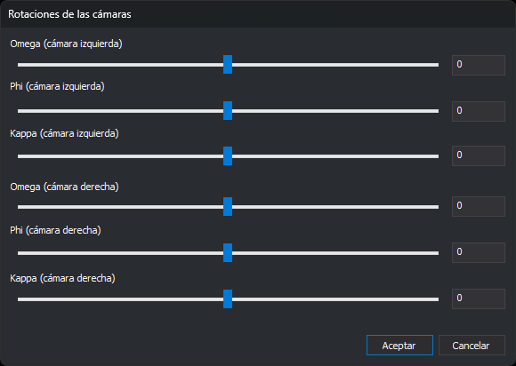

# ROTACIONES\_CAMARAS
<!-- id: rotaciones-camaras -->

Gira las imágenes de la ventana fotogramétrica con los ángulos _Omega_, _Phi_ y _Kappa_ de cada cámara.

## Parámetros

Esta orden no admite parámetros.

## Observaciones

Esta orden solicita los ángulos de giro de cada imagen en el cuadro de diálogo **Rotaciones de las cámaras**.

El cuadro de diálogo tiene un deslizador y un campo para cada ángulo: _Omega_, _Phi_ y _Kappa_ de la cámara izquierda y de la cámara derecha. Los ángulos van de -180 a 180 grados. El deslizador avanza en pasos de 0,1 grados; en el campo se puede escribir cualquier valor de ese intervalo.

Cada cambio se aplica a la imagen en el momento, tanto al mover un deslizador como al escribir un valor válido en un campo. Mientras el texto de un campo no es un número entre -180 y 180, por ejemplo mientras escribes el signo de un valor negativo, la imagen no cambia. Al pulsar **Aceptar** se validan los seis campos y, si alguno no es válido, aparece un mensaje y el cuadro de diálogo sigue abierto.

Si pulsas **Cancelar**, las imágenes vuelven a los ángulos que tenían al ejecutar la orden.

Si el modelo cargado es monoscópico, los controles de la cámara derecha aparecen deshabilitados y los de la cámara izquierda giran la única imagen.

Si el sensor está proyectando las imágenes, la orden no abre el cuadro de diálogo: muestra un globo que indica que en ese modo las imágenes no se pueden girar a mano, porque el sensor las gira a la dirección de la base para que la paralaje quede horizontal. En ese caso la opción del menú aparece deshabilitada.

El sensor de cámara cónica guarda los ángulos de la cámara izquierda y de la cámara derecha en el archivo del modelo, de manera que al volver a cargar ese modelo las imágenes mantienen el giro. No guarda un giro que coincida con el de una rectificación epipolar, porque ese lo calcula el sensor.

## Características de la orden

| Tipo de orden | Interactiva |
| :--- | :--- |
| Repite automáticamente | No |
| Opción del menú donde aparece la orden | Ventana fotogramétrica/Transformación de las imágenes/Rotaciones de las cámaras... |
| Barra de herramientas en la que aparece la orden | Esta orden no aparece en ninguna barra de herramientas |
| Extensión | Digi3D.CommonCommands.dll |
| Nombre interno | {C96276F0-D517-4AAB-A662-4A7FEC6BCFA8} |
| Variables relacionadas | No tiene variables relacionadas |
| Órdenes relacionadas | No tiene órdenes relacionadas |
