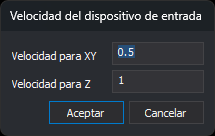

# VELOCIDAD
<!-- id: velocidad -->

Modifica la velocidad del restituidor.

## Parámetros

| Parámetro | Número real |
| :--- | :--- |
| Velocidad en X y en Y | No |
| Velocidad en Z | No |

## Observaciones

La ventana fotogramétrica tiene una velocidad para el plano XY y otra para el eje Z.

El formato de la orden es el siguiente:

**VELOCIDAD=\[xy\] \[z\]**

Si no se especifica una velocidad para Z, se establece la misma velocidad que para XY.

Sin parámetros, esta orden solicita las dos velocidades en el cuadro de diálogo **Velocidad del dispositivo de entrada**, que se abre con las velocidades actuales.

* **Velocidad para XY**: velocidad de movimiento en el plano XY.
* **Velocidad para Z**: velocidad de movimiento en el eje Z.

Al pulsar **Aceptar**, si alguno de los dos campos no es un número, aparece un mensaje y el cuadro de diálogo sigue abierto. Si pulsas **Cancelar**, las velocidades no cambian.

Las velocidades asignadas se guardan en la configuración del usuario \(valores de registro `VelocidadXY` y `VelocidadZ`\) y se muestran en la barra de estado de la ventana fotogramétrica.

La opción **Reiniciar** del menú ejecuta `VELOCIDAD=1.0 1.0`.

### Ejemplos:

`VELOCIDAD=5.75`

Establece la velocidad de XY y Z a 5.75

`VELOCIDAD=5.75 4.22`

Establece la velocidad de XY a 5.75 y la de Z a 4.22

## Características de la orden

| Tipo de orden | Orden interactiva sin parámetros; orden inmediata con parámetros |
| :--- | :--- |
| Repite automáticamente | No |
| Opción del menú donde aparece la orden | Ventana fotogramétrica/Velocidades/Asignar la velocidad... Ventana fotogramétrica/Velocidades/Reiniciar |
| Barra de herramientas en la que aparece la orden | _Esta orden no tiene asociado ningún botón en ninguna barra de herramientas_ |
| Extensión | Digi3D.CommonCommands.dll |
| Variables relacionadas | No tiene variables relacionadas |
| Órdenes relacionadas | [ESCALAR\_VELOCIDAD](/digi3d-ai/referencia/ventana-fotogrametrica/ordenes/e/escalar-velocidad.md) [VELOCIDAD\_MAS\_XY](/digi3d-ai/referencia/ventana-fotogrametrica/ordenes/v/velocidad-mas-xy.md) [VELOCIDAD\_MAS\_Z](/digi3d-ai/referencia/ventana-fotogrametrica/ordenes/v/velocidad-mas-z.md) [VELOCIDAD\_MENOS\_XY](/digi3d-ai/referencia/ventana-fotogrametrica/ordenes/v/velocidad-menos-xy.md) [VELOCIDAD\_MENOS\_Z](/digi3d-ai/referencia/ventana-fotogrametrica/ordenes/v/velocidad-menos-z.md) |
| Nombre interno | {3BE1084C-E1BC-4b4f-AD45-611112560D6B} |
