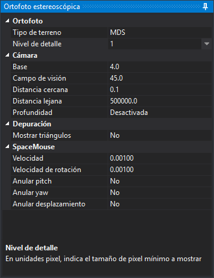

# Ortofoto estereoscópica
<!-- id: ortofoto-estereoscopica -->

El sensor Ortofoto estereoscópica muestra en estereoscopía una única ortofoto proyectada sobre un modelo digital del terreno (MDT) o un modelo digital de superficies (MDS). Las dos imágenes del par estereoscópico las generan dos cámaras virtuales separadas por la base indicada en el panel.

El sensor lee un archivo `.hmp` (mapa de alturas piramidal) que contiene la ortofoto y al menos uno de los dos modelos digitales. Este archivo se crea con el [Generador de archivos de Ortofoto Estereoscópica](../../generador-de-archivos-de-ortofoto-estereoscopica.md). Las opciones generales del sensor se configuran en [Ortofoto estereoscópica](../../cuadros-de-dialogo/configuracion/ortofoto-estereoscopica/README.md) del cuadro de diálogo **Configuración**.

## Panel Ortofoto estereoscópica

Al cargar el sensor, Digi3D.AI añade a la derecha de la ventana el panel **Ortofoto estereoscópica**, que no se puede cerrar. La zona inferior del panel muestra la descripción de la propiedad seleccionada. Los cambios se aplican en el momento.

### Ortofoto

| Propiedad | Descripción |
|---|---|
| **Tipo de terreno** | Modelo digital sobre el que se proyecta la ortofoto: **MDT** o **MDS**. Solo se ofrecen los modelos que contiene el archivo `.hmp`. Si contiene los dos, al cargar el sensor se usa el MDT. |
| **Nivel de detalle** | Divide el número de vértices de la malla de cada tesela: 1, 2, 4, 8, 16 o 32. Con 1 se usan todos los puntos del modelo digital; los valores mayores dibujan una malla más simple. Al cargar el sensor vale 1. |

### Cámara

| Propiedad | Descripción |
|---|---|
| **Base** | Distancia entre las dos cámaras virtuales, en píxeles de la ortofoto. Cuanto mayor es la base, mayor es el relieve que se percibe. |
| **Campo de visión** | Campo de visión vertical de las cámaras, en grados sexagesimales. |
| **Distancia cercana** | Distancia del plano cercano a la cámara. No se dibuja nada que esté más cerca. |
| **Distancia lejana** | Distancia del plano lejano a la cámara. No se dibuja nada que esté más lejos. |
| **Profundidad** | **Activada**: el terreno oculta las geometrías vectoriales que quedan detrás de él. **Desactivada**: las geometrías se dibujan siempre encima del terreno. |

### SpaceMouse

Estas propiedades afectan al control de la cámara con un SpaceMouse de 3Dconnexion.

| Propiedad | Descripción |
|---|---|
| **Velocidad** | Factor que multiplica los desplazamientos del SpaceMouse. |
| **Velocidad de rotación** | Factor que multiplica los giros del SpaceMouse. |
| **Anular pitch** | Si se activa, se ignoran los giros sobre el eje de cabeceo (pitch). |
| **Anular yaw** | Si se activa, se ignoran los giros sobre el eje de guiñada (yaw). |
| **Anular desplazamiento** | Si se activa, se ignoran los desplazamientos en los tres ejes. |

Los giros sobre el eje de alabeo (roll) se ignoran siempre: el horizonte de la cámara permanece fijo.

Digi3D.AI guarda entre sesiones los valores de **Base**, **Campo de visión**, **Distancia cercana**, **Distancia lejana**, **Profundidad**, **Velocidad** y **Velocidad de rotación**. **Tipo de terreno**, **Nivel de detalle** y las tres casillas de anular vuelven a su valor inicial cada vez que se carga el sensor.
