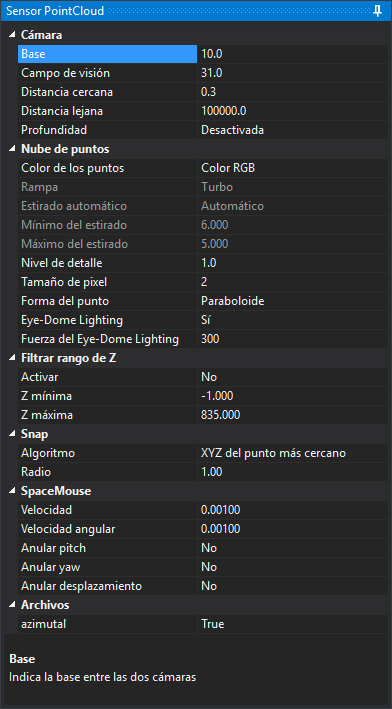

# PointCloud
<!-- id: point-cloud -->

El sensor PointCloud permite visualizar y medir sobre nubes de puntos en estereoscopía. Las dos imágenes del par las generan dos cámaras virtuales separadas por la base indicada en el panel.

El sensor carga las nubes de dos orígenes, que un mismo proyecto puede combinar:

- **Archivos locales**: los archivos `.las`, `.laz`, `.pts`, `.e57` y `.ptx` del directorio de trabajo del proyecto.
- **Nubes remotas**: las URL del nodo `<clouds>` del archivo `.d3d`. Cada URL apunta a un nivel de detalle publicado en un contenedor de blobs de Azure, o a un catálogo `.json` que enumera varios. La URL se indica al crear el proyecto, en la propiedad **URL de la nube de puntos**.

## Creación del nivel de detalle

Digi3D.AI no dibuja un archivo local directamente: al abrir el proyecto crea a partir de él un nivel de detalle (archivos `.index` e `.index.points`) en el [directorio de nivel de detalle](../../cuadros-de-dialogo/configuracion/creacion-de-archivos-de-nivel-de-detalle-de-pointcloud/directorio-de-nivel-de-detalle.md). El nivel de detalle se crea la primera vez que se abre el archivo; las aperturas siguientes lo reutilizan mientras el archivo original conserve la misma fecha de modificación. Una nube remota ya es un nivel de detalle y no pasa por este proceso.

Durante la apertura se muestra el cuadro de diálogo **Creando nivel de detalle**, con el progreso de la fase actual y el progreso total; el título del cuadro de diálogo indica la fase. El botón **Cancelar** o la tecla Esc detienen la creación: el título cambia a **Cancelando...**, Digi3D.AI borra los archivos a medio escribir de la nube que se estaba procesando, muestra el mensaje «Se ha cancelado la creación del nivel de detalle. No se ha abierto la nube de puntos.» y el proyecto no se abre. Se conservan los niveles de detalle de las nubes que terminaron antes de pulsar **Cancelar** y el archivo `.prj` con el sistema de referencia elegido. Si se pulsa **Cancelar** cuando ya no queda ninguna nube por procesar, el proyecto se abre. En la siguiente apertura, Digi3D.AI vuelve a crear desde el principio el nivel de detalle de la nube cancelada.

Las opciones de la creación se configuran en [Creación de archivos de nivel de detalle de PointCloud](../../cuadros-de-dialogo/configuracion/creacion-de-archivos-de-nivel-de-detalle-de-pointcloud/README.md) del cuadro de diálogo **Configuración**.

## Sistema de referencia

Digi3D.AI toma el sistema de referencia del primer archivo local, en este orden: del archivo `.prj` de su nivel de detalle, de la cabecera GeoTIFF del archivo `.las` o, si no lo encuentra en ninguno de los dos, del sistema que el usuario selecciona en el cuadro de diálogo que se muestra en ese momento. La selección se guarda en el `.prj` del nivel de detalle.

En un proyecto que solo tiene nubes remotas, el sistema de referencia es el del archivo `.prj` publicado junto a la primera nube. Si el contenedor no publica ese archivo, Digi3D.AI muestra el cuadro de diálogo de selección la primera vez y guarda el sistema elegido en `%TEMP%\LOP\Azure\<identificador de la nube>\sistema-referencia.prj`. Digi3D.AI calcula el identificador con la URL sin la parte que sigue a `?`, que es donde va la firma de acceso compartido (SAS): el archivo no contiene el token, y una SAS renovada sigue usando el mismo archivo. Si el archivo guardado no contiene un sistema de referencia válido, Digi3D.AI vuelve a mostrar el cuadro de diálogo y sobrescribe el archivo.

## Panel Sensor PointCloud

Al cargar el sensor, Digi3D.AI añade a la derecha de la ventana el panel **Sensor PointCloud**. La zona inferior del panel muestra la descripción de la propiedad seleccionada. Los cambios se aplican en el momento.

### Cámara

| Propiedad | Descripción |
|---|---|
| **Base** | Separación entre las dos cámaras virtuales, en tanto por mil de la distancia del plano de la cámara al cursor. Cuanto mayor es la base, mayor es el relieve que se percibe. |
| **Campo de visión** | Campo de visión vertical de las cámaras, en grados sexagesimales. |
| **Distancia cercana** | Distancia del plano cercano a la cámara. No se dibuja nada que esté más cerca. |
| **Distancia lejana** | Distancia del plano lejano a la cámara. No se dibuja nada que esté más lejos. |
| **Profundidad** | **Activada**: la nube oculta las geometrías vectoriales que quedan detrás de ella. **Desactivada**: las geometrías se dibujan siempre encima de la nube. |

### Nube de puntos

| Propiedad | Descripción |
|---|---|
| **Color de los puntos** | Magnitud que determina el color de cada punto: **Color RGB**, **Clasificación**, **Intensidad**, **Cota**, **RGB × Intensidad**, **Por nube** (un color distinto para cada nube del proyecto) o **Número de retorno**. |
| **Rampa** | Rampa de color con la que se pintan **Intensidad**, **Cota** y **Número de retorno**: **Escala de grises**, **Arcoíris**, **Viridis**, **Turbo** o **Azul-rojo**. Con los demás valores de **Color de los puntos** la propiedad no se puede editar. |
| **Estirado automático** | Rango de valores de la magnitud que se reparte a lo largo de la rampa; con **RGB × Intensidad**, el rango de la intensidad que multiplica el color. **Automático**: el rango entre los percentiles 2 y 98 de cada nube; con **Cota**, un único rango que abarca los de todas las nubes visibles. **Manual**: el rango entre **Mínimo del estirado** y **Máximo del estirado**. Solo se puede editar con **Intensidad**, **Cota** y **RGB × Intensidad**. |
| **Mínimo del estirado** | Inicio del rango manual, en las unidades de la magnitud: unidades de Z del sistema de referencia para la cota, valor sin escalar para la intensidad. Solo se puede editar con el estirado en **Manual**. Al pasar a **Manual**, o al cambiar **Color de los puntos** con el estirado en **Manual**, Digi3D.AI rellena el mínimo y el máximo: con la cota, con la Z mínima y la Z máxima de las nubes; con la intensidad, con los percentiles 2 y 98 de las nubes. |
| **Máximo del estirado** | Final del rango manual, en las mismas unidades que **Mínimo del estirado**. |
| **Nivel de detalle** | Umbral con el que se decide si una tesela se sustituye por sus teselas hijas, que tienen más puntos. La tesela se subdivide mientras la separación entre sus puntos, proyectada en pantalla y medida en píxeles, supera este valor: con valores menores se dibujan más puntos. El valor también limita el diámetro máximo de los puntos, que es **Tamaño de pixel** × **Nivel de detalle** píxeles. |
| **Tamaño de pixel** | Factor que multiplica el diámetro de los puntos en pantalla. El diámetro es proporcional a la separación entre los puntos de la tesela proyectada en pantalla, con un mínimo de 1 píxel. |
| **Forma del punto** | **Cuadrado**: el punto ocupa un cuadrado de píxeles. **Redondo**: se descartan los píxeles de las esquinas. **Paraboloide**: además de redondo, la profundidad de cada píxel aumenta hacia el borde del punto, de modo que los puntos que se solapan forman una superficie continua. |
| **Eye-Dome Lighting** | Sombreado por diferencia de profundidad en pantalla (EDL, *Eye-Dome Lighting*): oscurece cada píxel en función de cuánto más lejos de la cámara está que los píxeles vecinos. Muestra el relieve de la nube aunque los puntos no tengan color. Funciona con cualquier valor de **Color de los puntos**. |
| **Fuerza del Eye-Dome Lighting** | Intensidad del oscurecimiento del EDL. Con valores mayores, el relieve tiene más contraste. Solo se puede editar con **Eye-Dome Lighting** en **Sí**. |

### Filtrar rango de Z

| Propiedad | Descripción |
|---|---|
| **Activar** | **Sí**: solo se dibujan los puntos cuya Z está entre **Z mínima** y **Z máxima**. El filtro también se aplica a los algoritmos de snap **Z del punto más alto** y **Z del punto más bajo**. |
| **Z mínima** | Límite inferior del rango, en unidades del sistema de referencia. |
| **Z máxima** | Límite superior del rango, en unidades del sistema de referencia. |

### Snap

El snap ajusta el cursor a los puntos de la nube que están a menos de **Radio** del rayo que sale de la cámara, pasa por el cursor y termina en la **Distancia lejana**. Solo actúa con el botón **Snap** de la barra de herramientas activado. Considera los puntos de las teselas ya cargadas en memoria, incluidas las de las nubes ocultas en **Archivos**. Con varias nubes, Digi3D.AI aplica el algoritmo a cada nube y se queda con el punto resultante más cercano a la cámara.

| Propiedad | Descripción |
|---|---|
| **Algoritmo** | **Z del punto más alto**: el cursor conserva su X y su Y y toma la Z del punto más alto. **Z del punto más bajo**: igual, con el punto más bajo. **XYZ del punto más cercano**: el cursor se mueve al punto más cercano al rayo. |
| **Radio** | Distancia máxima de los puntos al rayo, en unidades del sistema de referencia. |

### SpaceMouse

Estas propiedades afectan al control de la cámara con un SpaceMouse de 3Dconnexion.

| Propiedad | Descripción |
|---|---|
| **Velocidad** | Factor que multiplica los desplazamientos del SpaceMouse. |
| **Velocidad angular** | Factor que multiplica los giros del SpaceMouse. |
| **Anular pitch** | Si se activa, se ignoran los giros sobre el eje de cabeceo (pitch). |
| **Anular yaw** | Si se activa, se ignoran los giros sobre el eje de guiñada (yaw). |
| **Anular desplazamiento** | Si se activa, se ignoran los desplazamientos en los tres ejes. |

Los giros sobre el eje de alabeo (roll) se ignoran siempre: el horizonte de la cámara permanece fijo.

### Archivos

La categoría tiene una casilla por cada nube cargada. La casilla muestra el nombre del archivo sin extensión o, en una nube remota, el último segmento de la URL sin la SAS. **Sí** dibuja la nube y **No** la oculta.

### Valores que se conservan

Digi3D.AI guarda en el registro de Windows, en el momento de cambiarlos, los valores de todas las propiedades excepto **Anular pitch**, **Anular yaw**, **Anular desplazamiento** y las casillas de **Archivos**, que vuelven a su valor inicial cada vez que se carga el sensor. Al guardar el proyecto, Digi3D.AI escribe también en el archivo `.d3d` las propiedades de **Cámara**, **Nube de puntos**, **Filtrar rango de Z** y **Snap**; al abrir el proyecto, los valores del `.d3d` tienen prioridad sobre los del registro.
