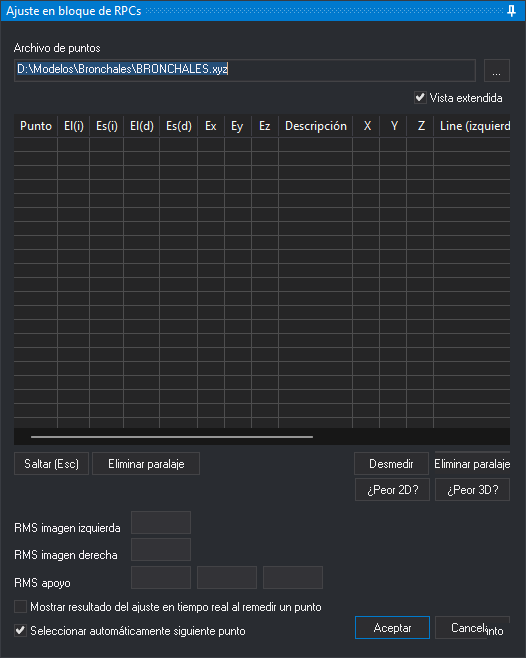

# Ajuste en bloque de RPCs
<!-- id: ajuste-en-bloque-de-rpcs -->

El panel **Ajuste en bloque de RPCs** calcula una corrección de los coeficientes RPC de las dos imágenes del modelo a partir de puntos de apoyo medidos en estereoscopía (ajuste RPCBA, *RPC Block Adjustment*). La corrección compensa desplazamientos y deformaciones afines de las coordenadas imagen.

Para abrirlo, selecciona la opción **Ventana fotogramétrica/Orientaciones/Ajuste en bloque de RPCs**. La opción solo funciona si:

* El sensor activo es el sensor [Satélite RPC](README.md) estereoscópico.
* No hay otra orden de ajuste en bloque de RPCs en ejecución.
* La imagen izquierda y la derecha del modelo son distintas.

Si no se cumple alguna condición, Digi3D.AI muestra un mensaje y la orden termina.

## Al empezar

1. Digi3D.AI pone a cero los términos de corrección afín de los RPC de las dos imágenes. Las medidas se hacen sobre los RPC sin corregir, aunque el modelo tuviera un ajuste guardado.
2. Digi3D.AI carga el último archivo de puntos utilizado. Si no existe, solicita uno con el cuadro de diálogo de abrir archivo; si se cancela, la orden termina.
3. Si existe el archivo `<directorio de trabajo>\<nombre del modelo>.rpcba`, Digi3D.AI carga las medidas guardadas en una sesión anterior.

## Archivo de puntos

Archivo de texto con un punto por línea: nombre, X, Y, Z y, opcionalmente, una descripción, separados por espacios. Las líneas con menos de cuatro campos se ignoran. Solo se cargan los puntos cuya proyección cae dentro de las dos imágenes.

El campo **Archivo de puntos** muestra la ruta del archivo cargado. El botón **...** permite elegir otro archivo (`.xyz`, `.pnt`, `.ctl` o `.txt`): la lista pasa a contener los puntos del archivo nuevo y las medidas de los puntos con el mismo nombre se conservan. Si el archivo no se puede abrir, se mantiene el anterior.

## Lista de puntos

Cada fila es un punto del archivo de puntos. Las columnas son:

| Columna | Contenido |
|---|---|
| **Punto** | Nombre del punto. |
| **Ef(i)**, **Ec(i)** | Residuo en fila y en columna de la imagen izquierda, en píxeles: posición calculada con el ajuste menos posición medida. |
| **Ef(d)**, **Ec(d)** | Residuo en fila y en columna de la imagen derecha, en píxeles. |
| **Ex**, **Ey**, **Ez** | Diferencia entre la posición ajustada del punto y sus coordenadas del archivo de puntos, en unidades del sistema de referencia de coordenadas del sensor. |
| **Descripción** | Descripción del punto en el archivo de puntos. |

Las columnas de residuos están vacías mientras el punto no esté medido o no se haya calculado el ajuste.

Si se activa la casilla **Vista extendida**, la lista añade las columnas **X**, **Y** y **Z** (coordenadas del archivo de puntos) y **Fila** y **Columna** medidas en cada imagen. El estado de la casilla se conserva entre sesiones.

## Medir un punto

1. Haz clic en el punto en la lista. Digi3D.AI lleva el cursor a sus coordenadas y la barra de estado muestra el mensaje **Digitaliza el punto *nombre* estereoscópicamente**.
2. Coloca el cursor sobre el punto en estereoscopía y pulsa el botón de registro. Digi3D.AI guarda la fila y la columna del cursor en las dos imágenes y recalcula el ajuste.

El ajuste se calcula cuando el número de puntos medidos alcanza el valor de [Número de puntos para calcular](../../../cuadros-de-dialogo/configuracion/parametros-del-ajuste-rpcba/numero-de-puntos-para-calcular.md). Las precisiones del ajuste se configuran en [Parámetros del ajuste RPCBA](../../../cuadros-de-dialogo/configuracion/parametros-del-ajuste-rpcba/README.md).

## Botones

| Botón | Acción |
|---|---|
| **Saltar (Esc)** | Deselecciona el punto que se está midiendo. Durante **Eliminar paralaje**, cancela la eliminación. Equivale a pulsar la tecla **Esc**. |
| **Eliminar paralaje** | Desplaza los RPC de la imagen derecha para eliminar el paralaje en un punto. Digitaliza un punto: Digi3D.AI bloquea la imagen izquierda en esa posición. Digitaliza después el mismo punto en la imagen derecha: la diferencia de fila y de columna entre las dos pulsaciones se suma a la corrección de la imagen derecha. La barra de estado indica qué imagen hay que digitalizar. |
| **Desmedir** | Borra las medidas del punto seleccionado y recalcula el ajuste. El punto sigue en la lista. |
| **Quitar punto** | Quita el punto seleccionado de la lista y borra sus medidas. El archivo de puntos no se modifica. |
| **¿Peor 2D?** | Selecciona el punto con mayor residuo en imagen (el mayor valor absoluto de fila o columna en cualquiera de las dos imágenes) y lleva el cursor a él para remedirlo. |
| **¿Peor 3D?** | Selecciona el punto con mayor diferencia en X, Y o Z entre su posición ajustada y sus coordenadas del archivo de puntos, y lleva el cursor a él. |

## Errores medios cuadráticos

* **RMS imagen izquierda** y **RMS imagen derecha**: raíz de la media de los cuadrados de los residuos en fila y columna de los puntos medidos, en píxeles.
* **RMS apoyo (X, Y, Z)**: raíz de la media de los cuadrados de **Ex**, **Ey** y **Ez**, en unidades del sistema de referencia de coordenadas del sensor.

Los campos están vacíos mientras no haya ajuste calculado.

## Opciones

* **Mostrar el resultado del ajuste en tiempo real al remedir un punto**: con un punto seleccionado, cada movimiento del cursor recalcula el ajuste como si el punto estuviera medido en la posición del cursor y actualiza la lista y los RMS. La medida no se guarda hasta que se pulsa el botón de registro.
* **Seleccionar automáticamente siguiente punto**: después de medir un punto, Digi3D.AI selecciona el primer punto sin medir, por orden de nombre, y lleva el cursor a él.

## Aceptar y Cancelar

**Aceptar** guarda el ajuste si está calculado:

* Los RPC corregidos de cada imagen, en `<directorio de trabajo>\<nombre de la imagen>.digi3d_rpcba`. El sensor Satélite RPC carga este archivo al abrir el modelo.
* Las medidas, en `<directorio de trabajo>\<nombre del modelo>.rpcba`.

Si no hay ajuste calculado, **Aceptar** cierra el panel sin guardar nada.

**Cancelar**, o terminar la orden de cualquier otra forma sin aceptar un ajuste, devuelve los RPC de las dos imágenes a los valores que tenían al empezar. Las medidas no se guardan.
