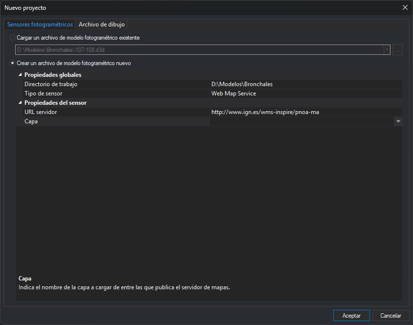
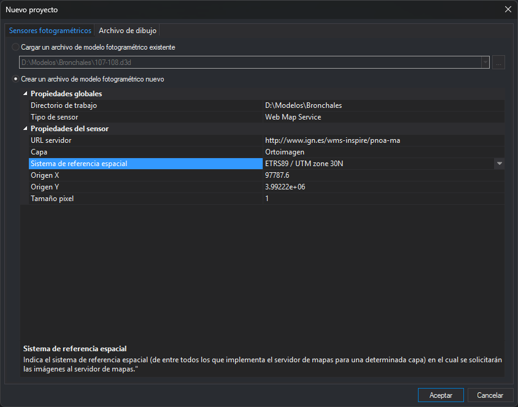
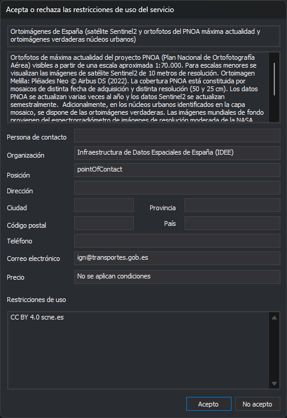
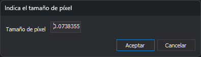

# Web Map Service
<!-- id: sensor-wms -->

El sensor Web Map Service muestra en la ventana fotogramétrica una capa de un servidor WMS (*Web Map Service*), por ejemplo la ortofoto del PNOA. El modelo tiene una sola imagen y no admite estereoscopía. Digi3D.AI pide al servidor las teselas de la zona visible a medida que te desplazas por el modelo.

Para ver las capas de un servidor WMS en la ventana de dibujo, consulta [Conectarse a un servidor WMS](/digi3d-ai/procedimientos/conectar-servidor-wms.md).

## Crear el modelo

En la pestaña [Sensores fotogramétricos](../../cuadros-de-dialogo/nuevo-proyecto/sensores-fotogrametricos.md) del cuadro de diálogo **Nuevo proyecto**, con **Crear un archivo de modelo fotogramétrico nuevo** y el **Tipo de sensor** **Web Map Service**, **Propiedades del sensor** muestra al principio solo la propiedad **URL servidor**:

1. En **URL servidor**, escribe la URL **GetCapabilities** del servidor WMS. Digi3D.AI se conecta al servidor y lee sus capacidades. Mientras tanto, la barra de estado muestra **Estableciendo conexión con el servidor...**.
2. Si la conexión funciona, aparece la propiedad **Capa**, vacía y seleccionada.
3. En **Capa**, elige la capa que quieres ver. Digi3D.AI no elige ninguna capa por defecto: si pulsas **Aceptar** sin elegirla, muestra el mensaje «Elige una capa del servidor WMS.» y el cuadro de diálogo sigue abierto.
4. Al elegir la capa aparecen las demás propiedades, con los valores que propone Digi3D.AI.

> En el servidor del PNOA (`http://www.ign.es/wms-inspire/pnoa-ma`), la ortofoto es la capa **Ortoimagen** (`OI.OrthoimageCoverage`). La capa **Mosaico** (`OI.MosaicElement`) muestra las huellas de los vuelos, no la ortofoto.

| Propiedad | Descripción |
| :--- | :--- |
| **Capa** | Capa del servidor que se muestra en el modelo. El desplegable lista los títulos de las capas que publica el servidor. No tiene valor por defecto. |
| **Sistema de referencia espacial** | Sistema de referencia de coordenadas en el que se piden las imágenes al servidor, de entre los que el servidor admite para la capa elegida. Los códigos EPSG se muestran con el nombre del sistema; si Digi3D.AI no lo conoce, se muestra **<Desconocido>**. Es también el sistema de referencia del modelo. |
| **Origen X** y **Origen Y** | Coordenadas en las que se carga el modelo. Digi3D.AI propone el centro del recuadro de la capa en el sistema de referencia elegido. |
| **Tamaño pixel** | Tamaño del píxel con el que se piden las imágenes al servidor, en unidades del sistema de referencia. |

Al cambiar **Capa** o **Sistema de referencia espacial**, Digi3D.AI vuelve a proponer el origen. Al cambiar **URL servidor**, la capa vuelve a quedar vacía y hay que elegirla otra vez.

El origen propuesto puede caer fuera de la zona con imagen. En el PNOA, el recuadro de las capas incluye las islas Canarias, y su centro (-7, 35,5 en CRS:84) está en el mar. En ese caso, escribe en **Origen X** y **Origen Y** un punto de tu zona de trabajo.

Si el sistema de referencia elegido es geográfico (por ejemplo CRS:84 o EPSG:4326), el tamaño de píxel propuesto se expresa en grados y equivale a 1 metro en el centro de la capa, calculado con las fórmulas geodésicas de Sodano sobre el elipsoide del sistema; en un sistema proyectado se propone 1 unidad del sistema.

Si la URL no es válida o el servidor no responde, Digi3D.AI muestra el error y quita las propiedades **Capa**, **Sistema de referencia espacial**, **Origen X**, **Origen Y** y **Tamaño pixel**.

La conexión usa el tipo de conexión a Internet de la configuración: directa, la del sistema o un proxy. Consulta [Tipo de conexión](../../cuadros-de-dialogo/configuracion/comunicacion-con-internet/tipo-de-conexion.md).

## Abrir el modelo

Al abrir el modelo, Digi3D.AI se conecta al servidor y muestra el cuadro de diálogo **Acepta o rechaza las restricciones de uso del servicio**. El cuadro muestra, sin permitir editarlos, los datos que publica el servidor:

* El título y el resumen del servicio.
* **Persona de contacto**, **Organización**, **Posición**, **Dirección**, **Ciudad**, **Provincia**, **Código postal**, **País**, **Teléfono** y **Correo electrónico**.
* **Precio**: las tarifas del servicio.
* **Restricciones de uso**: las condiciones de uso del servicio.

Pulsa **Acepto** para abrir el modelo. Con **No acepto**, el modelo no se abre y Digi3D.AI muestra el mensaje **No se han aceptado las condiciones de uso del servicio.** El cuadro aparece cada vez que se abre el modelo.

Si el servidor ya no publica la capa del modelo, Digi3D.AI muestra el mensaje **No se ha seleccionado ninguna capa.** y no abre el modelo.

## Teselas y caché

Digi3D.AI pide las teselas al servidor en formato JPEG y las guarda en la carpeta temporal de Windows, en la subcarpeta **Caché WMS**, por servidor, capa, estilo, sistema de referencia y tamaño de píxel. Una tesela que ya está en la caché no se vuelve a pedir.

Si el servidor no devuelve una imagen, la tesela se dibuja en rojo y el panel [Resultados](../../paneles/resultados.md) muestra **No se ha podido obtener una imagen del servidor WMS.**, con el motivo y la petición enviada. Cada motivo se muestra una sola vez.

## Botones de la barra de herramientas

El sensor añade estos botones a la barra de herramientas de la ventana fotogramétrica:

| Botón | Descripción |
| :--- | :--- |
| **Conectar** | Activa o desactiva la conexión con el servidor. Aparece marcado mientras la conexión está activa, que es el estado al abrir el modelo. Con la conexión desactivada, Digi3D.AI no pide teselas nuevas al servidor. |
| **+** | Divide entre 2 el tamaño de píxel: el servidor devuelve imágenes con más detalle. |
| **-** | Multiplica por 2 el tamaño de píxel: el servidor devuelve imágenes de una zona mayor. |
| **Tamaño pixel** | Abre el cuadro de diálogo **Indica el tamaño de píxel**, que muestra el tamaño de píxel actual en el campo **Tamaño de píxel**. **Aceptar** aplica el valor escrito si es distinto del actual; **Cancelar** cierra el cuadro sin cambiarlo. |

Al cambiar el tamaño de píxel con **+**, **-** o **Tamaño pixel**, el origen del modelo pasa a ser la posición actual del cursor y Digi3D.AI vuelve a pedir las teselas.
