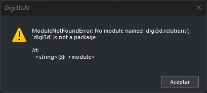

# Actualizar los controles de calidad Python de una tabla de códigos
<!-- id: actualizar-guiones-python -->

Los controles de calidad Python de las tablas de códigos creadas para versiones anteriores de Digi3D no son compatibles con Digi3D.AI. Al abrir un archivo de dibujo con una de esas tablas, o al analizar el control de calidad, Digi3D.AI muestra un error como este:



```text
ModuleNotFoundError: No module named 'digi3d.relations'; 'digi3d' is not a package
```

Para resolverlo, sustituye el entorno Python de la tabla de códigos por la última versión de los [controles de calidad de Digi21](https://github.com/digi21/Guiones-Control-Calidad-Python-Digi3D).

## Pasos

1. **Haz una copia de seguridad del archivo de la tabla de códigos.** Los controles nuevos no funcionan con las versiones anteriores de Digi3D: si vas a seguir usando la tabla con ellas, usa la copia.
2. Abre la tabla de códigos con el [Editor de tablas de códigos](../referencia/editor-de-tablas-de-codigos/README.md).
3. Selecciona la pestaña [Entorno Python](../referencia/editor-de-tablas-de-codigos/pestanas/entorno-python.md).
4. Pulsa el botón **Descargar de GitHub la última versión**, debajo del editor. El contenido de la pestaña se sustituye por la versión descargada.
5. Pulsa **Aplicar**.
6. Pulsa **Aceptar**.


Al abrir de nuevo el archivo de dibujo en Digi3D.AI, los controles de calidad funcionan.

> Si habías añadido funciones propias al entorno Python de la tabla, el paso 4 las borra. Cópialas antes de pulsar el botón y pégalas después al final del entorno descargado. Si usan módulos de la versión anterior (como `digi3d.relations`), tendrás que adaptarlas a la [API de Python de Digi3D.AI](../programacion/python/controles-de-calidad/README.md).

## Véase también

* [Controles de calidad](../programacion/python/controles-de-calidad/README.md)
* [Pestaña Entorno Python](../referencia/editor-de-tablas-de-codigos/pestanas/entorno-python.md)
