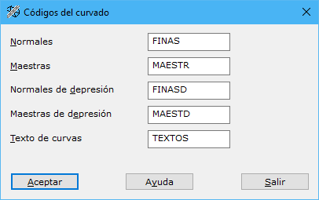

# Códigos de Curvado

[Cuadro de diálogo Curvado](./)

En este cuadro de diálogo se pueden indicar los códigos de las diferentes entidades que conformarán el curvado. Aquí aparecen los siguientes campos a rellenar:

* **Normales**: Código de las curvas de nivel finas.
* **Maestras**: Código de las curvas de nivel maestras.
* **Normales de depresión**: Código de las curvas de nivel finas de depresión. Estas curvas de nivel son aquellas curvas de nivel cerradas de hoyas o simas.
* **Maestras de depresión**: Código de las curvas de nivel maestras de depresión.
* **Texto de curvas**: Código de los textos de rotulación de las curvas maestras.
