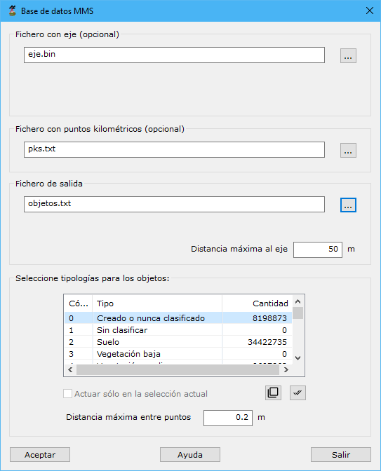

# Base de datos MMS

[Ficha de herramientas MMS Trazado](./)

[Ver video explicativo en YouTube](https://youtu.be/SN8sfjfVp1g)  
Relleno de base de datos con los activos de un vial a partir de datos MMS
