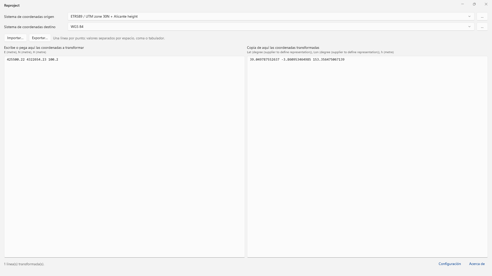

# Ventana principal



La ventana principal de Reproject contiene, de arriba abajo:

* **Sistema de coordenadas origen**: lista desplegable y botón **…**.
* **Sistema de coordenadas destino**: lista desplegable y botón **…**.
* Botones **Importar…** y **Exportar…**.
* Dos columnas de texto: a la izquierda, las coordenadas que se transforman; a la derecha, las coordenadas transformadas.
* Barra de estado, con los enlaces **Configuración** y **Acerca de**.
* Banda de error. Solo aparece cuando no se puede crear la transformación.

## Transformar coordenadas paso a paso

1. Pulsa el botón **…** de **Sistema de coordenadas origen** y selecciona el sistema de las coordenadas que tienes. Consulta [Selección del sistema de coordenadas](/reproject/seleccion-del-sistema-de-coordenadas.md).
2. Pulsa el botón **…** de **Sistema de coordenadas destino** y selecciona el sistema al que quieres transformarlas.
3. Si el catálogo EPSG ofrece varias transformaciones entre los dos sistemas, el programa muestra el cuadro **Seleccionar transformación**. Elige una. Consulta [Transformaciones y modelos de geoide](/reproject/transformaciones-y-modelos-de-geoide.md).
4. Escribe o pega las coordenadas en la columna **Escribe o pega aquí las coordenadas a transformar**, o pulsa **Importar…** para leerlas de un archivo.
5. Copia el resultado de la columna **Copia de aquí las coordenadas transformadas**, o pulsa **Exportar…** para guardarlo en un archivo.

El programa transforma las coordenadas al seleccionar los sistemas y cada vez que cambia el texto de la columna izquierda. No hay botón de transformar.

## Listas desplegables de origen y destino

Las dos listas desplegables comparten la lista de sistemas recientes: los últimos 12 sistemas seleccionados, el más reciente primero. Elegir un sistema de la lista equivale a seleccionarlo con el botón **…**.

Al cerrar y volver a abrir el programa, Reproject restaura los sistemas de origen y destino, la lista de recientes y la transformación elegida para ese par de sistemas.

## Formato de las coordenadas de entrada

* Una línea por punto.
* Los valores de una línea se separan con espacio, coma, punto y coma o tabulador.
* El separador decimal es el punto (`.`). La coma no sirve como separador decimal porque separa valores.
* Cada línea tiene tantos valores como ejes tiene el sistema de origen. El programa lee los primeros valores de la línea y descarta los que sobran.
* El orden de los valores es el orden de los ejes del sistema de origen. Debajo del título de cada columna se muestran los ejes del sistema, separados por comas, con su unidad entre paréntesis.
* Las líneas vacías se conservan en el resultado.

Ejemplo para un sistema proyectado con altura:

```
435600.42 4532954.10 602.59
435601.23 4532961.10 600.42
```

La orientación de ejes de un sistema geográfico o proyectado se cambia en el cuadro de selección del sistema, con la opción **Orientación de ejes**.

## Formato del resultado

* Una línea de resultado por cada línea de entrada, en la misma posición.
* Los valores se separan con un espacio y usan el punto como separador decimal, con un máximo de 12 decimales.
* El orden de los valores es el orden de los ejes del sistema de destino, que se muestra debajo del título de la columna derecha.

Una línea que no se puede transformar no detiene el resto. En su lugar, el resultado muestra un mensaje de error:

| Mensaje | Causa |
|---|---|
| `· error: se esperaban N valores` | La línea tiene menos valores que ejes el sistema de origen. |
| `· error: valor numérico no válido` | Uno de los valores no es un número. |
| `· error: <mensaje>` | La transformación del punto ha fallado. El mensaje es el del motor de cálculo. |

## Importar y exportar coordenadas

* **Importar…** abre un archivo `.txt`, `.csv` o de cualquier otra extensión y copia su contenido en la columna izquierda. El archivo debe seguir el formato de entrada descrito arriba.
* **Exportar…** guarda el contenido de la columna derecha en un archivo `.txt` o `.csv`. El nombre propuesto es `coordenadas-transformadas`.

## Barra de estado

La barra de estado muestra:

* Al iniciar el programa, la ruta de la base de datos EPSG, o el error si no se puede abrir.
* Al crear la transformación, los nombres de los sistemas de origen y destino (`origen → destino`). Si los dos sistemas son equivalentes: «Transformación identidad (origen y destino equivalentes)».
* Al transformar, el número de líneas transformadas y, si las hay, el número de líneas con error.

Los enlaces de la barra de estado abren:

* **Configuración**: el directorio de modelos de geoide. Consulta [Transformaciones y modelos de geoide](/reproject/transformaciones-y-modelos-de-geoide.md).
* **Acerca de**: la versión del catálogo EPSG, los enlaces a los repositorios de Reproject y CrsKit, y las condiciones de uso de los datos EPSG.

## Banda de error

Si el programa no puede crear la transformación entre los dos sistemas, muestra el mensaje completo en una banda de error en la parte inferior de la ventana: «No se pudo crear la transformación: …». La columna de resultado queda vacía. La banda se cierra con su botón de cierre o al crear una transformación válida.
